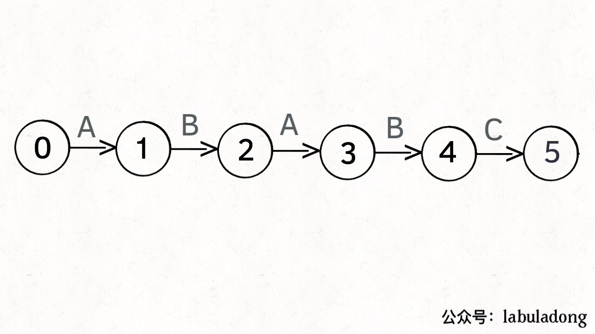
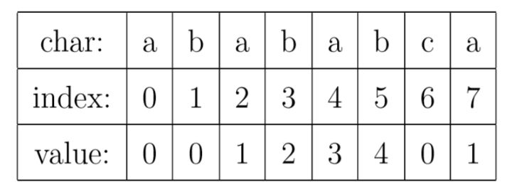
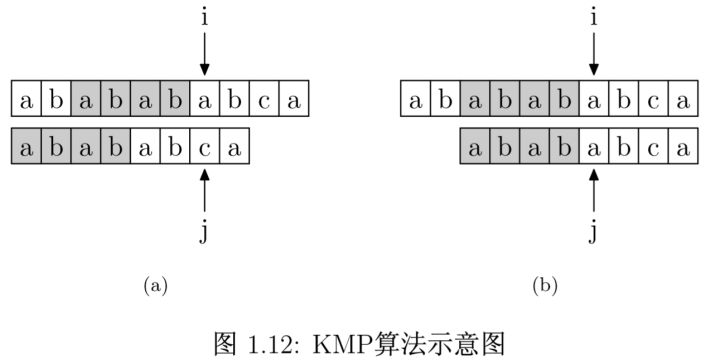
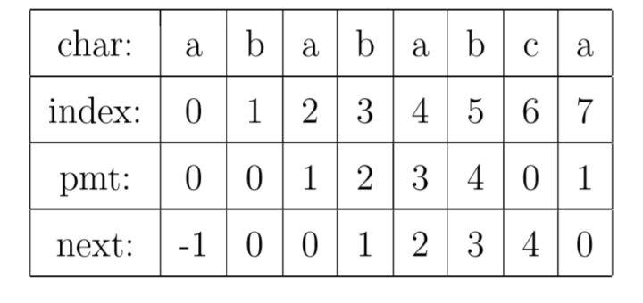

## 最长回文字符串
[Leetcode第五题](https://leetcode-cn.com/problems/longest-palindromic-substring/submissions/)

采用马拉车算法的思想，但是第一版的代码没有剪枝，导致时间上只超过了50的人，马拉车算法分三部：
- 构造特殊字符串
- **根据先前计算出的回文半径进行剪枝**
- 遍历回文半径数组得到最优解

第一版代码
```
public class number5 {
    public String longestPalindrome(String s) {
        StringBuilder ss = new StringBuilder(2001);
        int len = s.length();
        if(len < 2) return s;
        ss.append('#');
        for(int i =0;i<len;i++){
            ss.append(s.charAt(i));
            ss.append('#');
        }
        int cc = 0;
        int mark = 0;
        for(int i = 1;i < ss.length();i++){
            int c = 0;
            int j = i + 1;
            int k = i - 1;
            while (j < ss.length() && k >= 0){
                if(ss.charAt(j) == ss.charAt(k)){
                    ++j;
                    --k;
                    c++;
                }else{
                    break;
                }
            }
            if(cc < c){
                mark = i;
                cc = c;
            }
        }
        StringBuilder res = new StringBuilder(100);
        for(int i = mark - cc;i < mark + cc;i++){
            if(ss.charAt(i) == '#'){
                continue;
            }
            else {
                res.append(ss.charAt(i));
            }
        }
        return res.toString();
    }
}

```

### 最长公共子序列和最长公共子串有区别
子序列可以分开，子串必须连续

[子串问题-leetcode](https://leetcode-cn.com/problems/maximum-length-of-repeated-subarray/)


### 字符串匹配
Leetcode 28，采用KMP算法实现了时间复杂度为$O(N)$的算法，具体为通过构造一个模式串的跳转规则进行简化，因为在暴力搜索中，每次不匹配之后都会重头进行，而KMP则简化了这一过程，使得其可以尽量少的回溯。

#### 状态机方法
我们可以将模式字符看做一个确定状态机的转换过程，如串“ABABC”的状态转移如下所示：
<div align = center>

</div>
只有当满足转移到下一个状态的条件时，才会进行转移，但是并不是所有不满足的情况都会跳转到状态0（暴力就是这样做的），例子就是在状态4时，需要C才能进入状态5，但是接下来的字符串是A的话，则会进入状态3，因为观察可得目前匹配串和模式串是有ABA这个子串重合的，所以不需要跳转到状态0。下面是其完整的状态转移图。
<div align = center>

</div>
当出现其他的字符时，肯定为转移到状态0，所以在图中省略了。KMP的转移数组只跟模式串有关，跟匹配串是无关的。这是使用状态机方法得到的结果。


因此我们可以得到算法如下：
```

```

#### KMP方法
KMP其实是利用了前后缀匹配的性质使得i不回溯，并且减少j回溯的方法。例如模式串是“abababca”的话，PMT（部分匹配表）就是前后缀最长匹配表就是，0,0,1,2,3,4,0.如图所示：
<div align = center>

</div>
当发生以下情况时：i和j不匹配，此时可以根据PMT表查找j-1位的值，j只需要指向PMT[j-1]的位置就好了。
<div align = center>

</div>
要在主字符串"ababababca"中查找模式字符串"abababca"。如果在 j 处字符不匹配，那么由于前边所说的模式字符串 PMT 的性质，主字符串中 i 指针之前的 PMT[j −1] 位就一定与模式字符串的第 0 位至第 PMT[j−1] 位是相同的。这是因为主字符串在 i 位失配，也就意味着主字符串从 i−j 到 i 这一段是与模式字符串的 0 到 j 这一段是完全相同的。而我们上面也解释了，模式字符串从 0 到 j−1 ，在这个例子中就是”ababab”，其前缀集合与后缀集合的交集的最长元素为”abab”， 长度为4。所以就可以断言，主字符串中i指针之前的 4 位一定与模式字符串的第0位至第 4 位是相同的，即长度为 4 的后缀与前缀相同。这样一来，我们就可以将这些字符段的比较省略掉。具体的做法是，保持i指针不动，然后将j指针指向模式字符串的PMT[j −1]位即可。

通过将PMT字符串进行移位，得到next数组.并且通过编程实现。
<div align = center>

</div>

算法代码
```
void getNext(string s, int* next)
{
    int len = s.size();
    next[0] = -1;
    int i = 0;
    int j = -1;
    while(i < len - 1)
    {
        if(j == -1 || s[j] == s[i])
        {
            ++j;
            ++i;
            next[i] = j;
        }
        else
        {
            j = next[j];
        }
    }
}
int strStr(string haystack, string needle) {
    int len1 = haystack.size();
    int len2 = needle.size();
    if(len2 == 0) return 0;
    int* next = new int[len2];
    getNext(needle,next);
    int i = 0;int j = 0;
    while(i < len1)
    {
        if(j == -1 || haystack[i] == needle[j])
        {
            ++i;
            ++j;
        }
        else
        {
            j = next[j];
        }
        if(len2 == j) return i - len2;
    }
    return -1;
}
```
[知乎讲解KMP](https://www.zhihu.com/question/21923021/answer/281346746)
