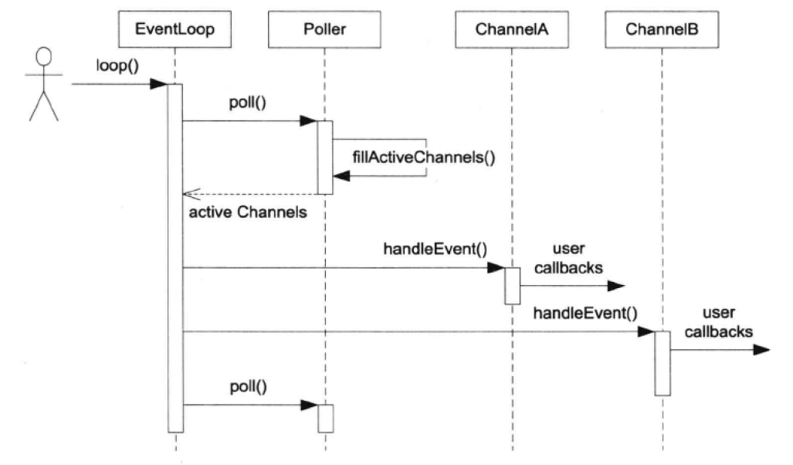

## Muduo
[连接建立和发送数据](https://mp.weixin.qq.com/s?__biz=MzA3MzU5NDY5Mg==&mid=2648663545&idx=1&sn=4501df315181150dda713176135df077&chksm=872767d2b050eec43cb2f961db71d17a43d75898ddb01c7cff6c2e5e0852cabd89c06cda87e5&token=195924822&lang=zh_CN#rd)

### TCPServer
TCPServer的启动，会伴随着线程池的启动，池中有固定数量的线程，其中一个会被作为新连接监听的线程（因为是one EventLoop for each thread），监听到的新连接会放入下一个线程中的EventLoop保持负载均衡。
- MessageCallback()是每次消息到达的回调。
- ConnectionCallback()是连接改变状态的回调。
- NewConnectionCallback()是Acceptor注册的新连接到达的回调。

server_.start()会对start执行情况进行判断，如果已经启动过了则不会执行。


### Acceptor
用于处理新连接，是TcpServer的内部类，数据成员：
- Socket：是Listening socket即server socket
- Channel：用于观察Readable事件，并回调：：handleRead()

Acceptor会进行Socket的创建和bind，这和Tcpserver中的是一样的，并且为Readable设置回调函数readCallback_()这是创建链接时的回调。

Acceptor::listen()会完成listen系统调用并将channel加入到epoll（loop）中。

[Acceptor例子讲解](https://blog.csdn.net/messiran10/article/details/51692078)


---

## 在一些代码中的锁的作用

聊天机器人中write()中加锁，并不是为了保护connection()，而是保护了share_ptr类型的connection_，因为它在增加引用的时候不是原子操作。[讲解](https://www.cnblogs.com/lenmom/p/9198126.html)

## Buffer的设计要点
- 对外表现成一块连续的内存（char* p, int len），以方便客户代码编写。
- 其size()可以自动增长，以适应不同大小的消息。并不是fixed size array。
- 内部以std::vector<char>来保存数据，并提供相应的访问函数。

Buffer其实是一个Queue，从末尾写入数据，从头部读取数据。TcpConnetction会有两个Buffer成员，input buffer和output buffer。

- input buffer：TcpConnection会从socket读取数据，然后写入input buffer；客户端从input buffer读取数据。
- output buffer：客户代码会把数据写入output buffer，TcpConnection会从output buffer读取数据并写入socket。

#### muduo::net::Buffer的设计
使用了固定分配+extrabuf额外空间的方式，通过readv()系统调用对两块不连续的空间进行写入，再使用append()进行连接。这样做的好处是减少了系统调用，见《muduo》8.7.2

其不是绝对的线程安全。但是
- 对于input buffer，OnMessage()回调始终发生在该TcpConnection所属的那个IO线程，应用程序应该在OnMessage()完成对input buffer的操作，并且不会讲input buffer暴露给其他线程，所以input buffer不必是线程安全的。
- 对于output buffer，程序不会直接操作，而是调用TcpConnection::send()来发送数据，后者是线程安全的。

---

## 并发数量的控制
高并发场景下会存在文件描述符资源，内存资源不够的情况，在这种情况下accept中的IO会陷入busy loop，影响其他连接，通常有几种做法限制。
- 调高进程的文件描述符限制。
- 关闭listening fd，并设定重新打开时间。
- 改用edge trigger如果漏掉一次accept，程序就再也收不到新连接。
- 一直准备一个空闲描述符，等到满了的时候使用，使用了之后马上close。（多进程下回出现资源竞争的情况）

## Reactor的关键结构

#### Channel class
每个fd会被Channel处理，为其IO事件分发不同的回调，例如ReadCallback、WriteCallback，用户不直接使用Channel，而是使用更加上层的TcpConnection。在Channel中，
events_是它关心的IO事件，由用户设置，revents_是目前活动的事件，由EventLoop/Polller设置。

#### Poller class
其核心功能时调用poll()获得当前活跃的IO事件，然后填充调用方传入的activeChannels（使用fillActiveChannels()遍历），并且返回return的时间。

### EventLoop class
事件循环类，IO任务或者计算任务都可以使用runInLoop()注册到里面，EventLoopThread class会在startLoop()时生成一个新的线程作为IO线程，原来的线程作为主线程。


#### runInLoop的含义
即使在其他的线程中加入事件，也可以使得其在其IO线程中执行，完成异步调用。
函数调用顺序：
```
IO线程内：
runInLoop()->cb()
IO线程外：
runInLoop()->queueInLoop()->wakeup()->write()->poll()->handleRead()
->doPendingFunctors()
```

时序图如下
<div align=center>

</div>

#### TimerQueue class
其需要高效地组织目前未到期的Timer，能快速的根据当前时间找到已经到期的Timer，也要能够高效地添加和删除Timer。最简单的实现方式是按照到期时间使用线性表作为数据结构。

另外一种做法是二叉堆组织优先队列，这种做法的复杂度降为$O(log N)$，但是C++标准中的make_heap()等函数不能高效的删除heap中间的某个元素，需要实现。

还有一种做法是建立一个二叉搜索树（std::set或者std::map），map无法直接处理两个timer相同到期的情况，需要另外处理。

#### EventLoopThread class
该类运行时会创建一个新的线程和一个新的EventLoop，满足one loop for each thread的设计理念。线程会在startloop中利用thread_create()进行创建。
