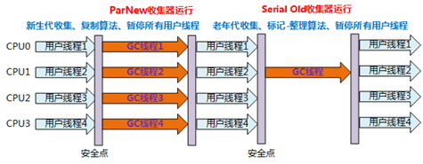
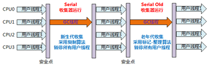
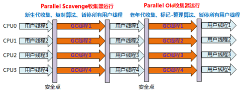
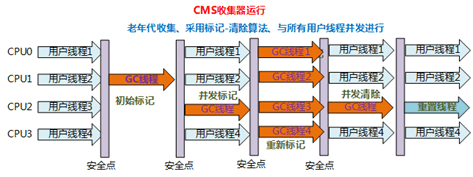

## 虚拟机内存结构
根据Java SE7的规定，Java虚拟机所管理的内存将会包括以下几个运行时数据区域：
#### 程序计数器（Program Counter Register）
程序计数器是一块较小的内存区域，它可以看做是当前线程所执行的字节码行号指示器。在虚拟机的概念模型里就是通过改变这个计数器的值来选取下一条需要执行的字节码指令。

由于Java虚拟机的多线程是通过线程轮换分配处理器时间的方式来进行的。在任何一个时刻，一个处理器只会执行一条线程中的指令。因此，每个线程都有一个独立的程序计数器，各条线程之间计数器互不影响，独立存储，我们称这类内存区域为“线程私有”的内存。

如果线程正在执行的是一个Java方法，这个计数器记录的是正在执行的虚拟机字节码指令的地址；如果正在执行的是Native方法，这个计数器值则为空（Undefined）。此内存区域是唯一一个在Java虚拟机规范中没有规定任何OutOfMemoryError情况的区域。

#### Java虚拟机栈（Java Virtual Machine Stacks）
这个区域也是线程私有的，它的生命周期与线程相同。虚拟机栈描述的是Java方法执行的内存模型：每个方法在执行的同时都会创建一个栈帧（Stack Frame）用于存储局部变量表、操作数栈、动态链接、方法出口的信息。每一个方法从调用直到执行完成的过程，就对应着一个栈帧在虚拟机栈中入栈到出栈的过程。

局部变量表中存放了编译期可知的各种基本数据类型、对象引用和returnAddress类型。局部变量表所需的内存空间在编译期间完成分配，当进入一个方法时，这个方法需要在帧中分配多大的局部变量空间是完全确定的，在方法运行期间不会改变局部变量表的大小。

在Java虚拟机规范中，对着个区域规定了两种异常状况：如果线程请求的栈深度大于虚拟机所允许的深度，将抛出StackOverflowError异常；如果虚拟机栈可以动态扩展（当前大部分的Java虚拟机都可动态扩展，只不过Java虚拟机规范中也允许固定长度的虚拟机栈），如果扩展时无法申请到足够的内存，就会抛出OutOfMemoryError异常。

##### 对象分配缓冲区
TLAB是属于线程私有分配，但是可以互相访问的，其他线程只是无法在此区域进行内存分配而已。该技术是针对逃逸分析得出的结论。会存在碎片。

JVM在内存新生代Eden Space中开辟了一小块线程私有的区域，称作TLAB（Thread-local allocation buffer）。默认设定为占用Eden Space的1%。在Java程序中很多对象都是小对象且用过即丢，它们不存在线程共享也适合被快速GC，所以对于小对象通常JVM会优先分配在TLAB上，并且TLAB上的分配由于是线程私有所以没有锁开销。因此在实践中分配多个小对象的效率通常比分配一个大对象的效率要高。
也就是说，Java中每个线程都会有自己的缓冲区称作TLAB（Thread-local allocation buffer），每个TLAB都只有一个线程可以操作，**TLAB结合bump-the-pointer技术可以实现快速的对象分配，而不需要任何的锁进行同步**，也就是说，在对象分配的时候不用锁住整个堆，而只需要在自己的缓冲区分配即可。


#### 本地方法栈（Native Method Stack）
本地方法栈与虚拟机栈锁发挥的作用是非常相似的，它们之间的区别不过是虚拟机栈为虚拟机执行Java方法服务，而本地方法栈则为虚拟机使用到的Native方法服务。在虚拟机规范中对本地方法栈中方法使用的语言、使用的方法与数据结构没有强制规定，本地方法栈也会抛出StackOverflowError和OutOfMemoryError异常。

#### Java堆（Java Heap）
对于大多数应用来说，Java堆是Java虚拟机所管理的内存中最大的一块。Java堆是被所有线程共享的一块内存区域，在虚拟机启动时创建。此区域的唯一目的就是存放对象实例，几乎所有对象实例以及数组都要在堆上分配，但是随着JIT编译期的发展和逃逸分析的逐渐成熟，栈上分配、标量替换优化技术将会导致一些微妙的变化发生，所有的对象都分配在堆上也不是绝对的了。

Java堆也是垃圾收集器管理的主要区域，因此很多时候也被称为“GC堆”（Garbage Colected Heap），从内存回收的角度来看，由于现在收集器基本都采用分代收集算法，所以Java堆中还可以细分为：新生代和老年代；再细致一点的有Eden空间、From Survivor空间、To Surivor空间等。从内存分配的角度看，线程共享的Java堆中可能划分出多个线程私有的分配缓冲区（Thread Local Allocation Buffer TLAB）。无论怎么划分，都和存放内容无关，无论哪个区域，存储的都仍然是对象实例，进一步划分的目的是为了更好地回收内存，或者更快地分配内存。如果堆中没有内存完成实例分配，并且堆也无法再扩展时，将会抛出OutOfMemoryError异常。

#### 方法区（Method Area）
和Java堆一样，是各个线程共享的内存区域，它用于存储已被虚拟机加载的类信息、常量、静态变量、即时编译器编译后的代码等数据。虽然Java虚拟机规范把方法区描述为堆的一个逻辑部分，但是它有一个别名叫做Non-Heap（非堆），目的是与Java堆区分开来。有OutOfMemoryError异常。

#### 运行时常量池
Class文件中除了有类的版本、字段、方法、接口等描述信息往外，还有一项信息是常量池（Constant Pool Table），用于存放编译器生成的各种字面量和符号引用，这部分内容将在类加载后进入方法区的运行时常量池中存放。这个池子是每一个类私有的。并不是一成不变的。在方法区中。
#### 字符串常量池
也是一种运行时的常量池，在运行的时候字符串常量会存储在这里，可以通过String.intern加入新的常量。（在堆中）

[字符串常量池](https://www.zhihu.com/question/22739143/answer/113822382)

#### 直接内存

## 逃逸分析
逃逸分析，是一种可以有效减少Java 程序中同步负载和内存堆分配压力的跨函数全局数据流分析算法。通过逃逸分析，Java Hotspot编译器能够分析出一个新的对象的引用的使用范围从而决定是否要将这个对象分配到堆上。

在计算机语言编译器优化原理中，逃逸分析是指分析指针动态范围的方法，它同编译器优化原理的指针分析和外形分析相关联。当变量（或者对象）在方法中分配后，其指针有可能被返回或者被全局引用，这样就会被其他过程或者线程所引用，这种现象称作指针（或者引用）的逃逸(Escape)。

经过逃逸分析之后，可以得到三种对象的逃逸状态。
1. GlobalEscape（全局逃逸）， 即一个对象的引用逃出了方法或者线程。例如，一个对象的引用是复制给了一个类变量，或者存储在在一个已经逃逸的对象当中，或者这个对象的引用作为方法的返回值返回给了调用方法。
2. ArgEscape（参数级逃逸），即在方法调用过程当中传递对象的应用给一个方法。这种状态可以通过分析被调方法的二进制代码确定。
3. NoEscape（没有逃逸），一个可以进行标量替换的对象。可以不将这种对象分配在传统的堆上。

编译器可以使用逃逸分析的结果，对程序进行一下优化。
1. 堆分配对象变成栈分配对象。一个方法当中的对象，对象的引用没有发生逃逸，那么这个方法可能会被分配在栈内存上而非常见的堆内存上。
2. 消除同步。线程同步的代价是相当高的，同步的后果是降低并发性和性能。逃逸分析可以判断出某个对象是否始终只被一个线程访问，如果只被一个线程访问，那么对该对象的同步操作就可以转化成没有同步保护的操作，这样就能大大提高并发程度和性能。
3. 矢量替代。逃逸分析方法如果发现对象的内存存储结构不需要连续进行的话，就可以将对象的部分甚至全部都保存在CPU寄存器内，这样能大大提高访问速度。


将堆分配转化为栈分配。如果一个对象在子程序中被分配，要使指向该对象的指针永远不会逃逸，对象可能是栈分配的候选，而不是堆分配。逆向思考，如果不想要一个对象逃逸的话，是可以分配到栈空间的。

[逃逸介绍](https://blog.csdn.net/yangzl2008/article/details/43202969)

[实例](http://www.hollischuang.com/archives/2398)

## 对象的创建
 虚拟机遇到一条new指令的时候，首先会去检查这个指令的参数是否能在常量池中定位到一个类的符号引用，并且检查这个符号引用是否已经被加载、解析和初始化过。如果没有那必须先执行相应的类加载过程。

 在类加载检查通过之后，接下来虚拟机将为新生对象分配内存。对象所需内存的大小在类加载完成后便可完全确定，为对象分配空间的任务等同于把一块确定大小的内存从Java堆中划分出来。

 内存分配完成后，虚拟机需要将分配的内存空间都初始化为零值（不包括对象头），这一步操作保证了对象的实例字段在Java代码中可以不赋初始值就直接使用，程序能访问到这些字段的数据类型所对应的零值。

 接下来对对象进行必要的设置，例如这个对象是属于哪个实例、如何才能找到类的元数据信息、对象的哈希码、对象的GC分代年龄等信息。这些信息存放在对象的对象头之中。根据虚拟机当前的运行状态的不同，如是否启用偏向锁等，对象头会有不同的设置方式。

 接下来才会进行对象的<init>初始化

 对象三部分：对象头，实例数据，对齐填充
 ```
对象头的第一部分用于存储对象自身的运行时数据，如哈希码、GC分代年龄、锁状态标志
、线程持有的锁、偏向线程ID、偏向时间戳等，官方称这部分的数据为“Mark Word”。

另一部分是类型指针，即对象指向它的类元数据的指针，虚拟机通过这个指针来确定这个
对象是哪个类的实例。并不是所有的虚拟机实现都必须在对象数据上保留类型指针。

如果对象是一个Java数组，那对象头中还必须有一块用于记录数组长度的数据，因为虚
拟机可以通过普通Java对象的元数据信息确定Java对象的大小，但是从数组的元数据中无
法确定数组的大小。
 ```

#### 对象的访问定位

使用引用访问对象实例，目前主流的有使用句柄和直接指针两种。
- 如果使用句柄的话，那么Java堆中将会划分出一块内存来作为句柄池，reference中存储的就是对象的句柄地址，而句柄中包含了对象实例数据与类型数据各自的具体地址信息。

- 如果使用直接指针访问，那么Java堆对象的布局中就必须考虑如何放置访问类型数据的相关信息，而reference中存储的直接就是对象地址。

## 垃圾回收器和内存分配策略
回收主要是回收的Java堆和方法区中的内存。

### 确定对象是否不可能再被任何途径使用
#### 引用计数法
给对象中添加一个引用计数器，每当有一个地方引用它时，计数器值就加1；当引用失效时，计数器的值就减1；任何时刻计数器为0的对象就是不可能再被使用的。

客观地说，引用计数算法实现简单，判定效率也很高，在大部分情况下它都是一个不错的算法，但是在对象循环引用的问题上很难解决。

#### 可达性分析算法
这个算法的基本思想就是通过一系列的称为“GC Roots”的对象作为起始点，从这些节点开始向下搜素，搜素所走过的路径称为引用链（Reference Chain），当一个对象到GC Roots没有任何引用链相连时，则证明此对象是不可用的。

在Java语言中，可作为GC Roots的对象包括下面几种：
- 虚拟机栈（栈帧中的本地变量表）中引用的对象。
- 方法区中类静态属性引用的对象。
- 方法区中常量引用的对象。
- 本地方法栈中JNI（Native方法）引用的对象。

### 引用分类
在JDK1.2之后，Java对引用的概念进行了扩充，将引用分为强引用（Strong Reference）、软引用（Soft Reference）、弱引用（Weak Reference）、虚引用（Phantom Reference）4种。
- 强引用就是指在程序代码之中普遍存在的，类似“Object obj = new Object()”这类的引用，只要强引用还存在，垃圾回收机制就永远不会回收被引用的对象。
- 软引用是用来描述一些还有用但并非必需的对象。对于软引用关联着的对象，在系统将要发生内存溢出异常之前，将会把这些对象列进回收范围之中进行第二次回收。如果这次回收还没有足够的内存，才会抛出异常。
- 弱引用也是用来描述非必需对象的，但是它的强度比软引用更弱一些，被弱引用关联的对象只能生存到下一次垃圾收集发生之前。当垃圾收集工作开始后，无论当前内存是否足够，都会回收掉只被弱引用关联的对象。
- 虚引用是最弱的一种引用关系。一个对象是否有虚引用的存在，完全不会对其生存时间构成影响，也无法通过虚引用来取得一个对象实例。为一个对象设置虚引用关联的唯一目的就是能在这个对象被收集器回收时收到一个系统通知。

### finalize()
当一个对象被标记为不可达之后，会进行两次标记，第一次标记后判断对象是否有必要执行finalize()方法，当对象没有覆盖finalize()方法，或者finalize()方法已经被虚拟机调用过，或者没有覆盖方法，则没有必要进行，当对象进行第二次标记的时候，就会真正被回收。

**finalize()函数只会被执行一次，所以一个对象只有一次救赎的机会**

### 回收方法区
方法区的垃圾回收主要回收两部分内容：废弃常量和无用的类。回收废弃常量和回收Java堆中的对象非常相似。当前系统没有任何一个引用引用了此常量，这时发生内存回收的话就会释放内存，判定一个类的话需要满足三个条件：
- 对该类的所有实例已经被回收，也就是Java堆中不存在该类的任何实例。
- 加载该类的ClassLoader已经被回收
- 该类对应的lava.lang.Class对象没有在任何地方被引用，无法在任何地方通过反射访问到该类的方法。

## 回收算法
### 标记清除算法
标记：标记的过程就是遍历所有GC Roots，然后将GC Roots可达的对象标为存活的对象。

清除：清除的过程将遍历堆中所有的对象，并对没有标记的对象全部清除

**注意：** 在进行标记清除算法的时候要暂停所有的线程活动，因为可能会存在操作到同一个对象但是先标记后被赋值了。

缺点：
- 效率低：递归扫描+全栈对象遍历，而且在进行GC的时候，需要停止应用程序。
- 这样清理出的空间是不连续的。

### 复制算法
复制算法将内存按照容量分为大小相等的两块，每次只使用其中一块，当这一块内存用完，就将还活着的对象复制到另外一块上面，然后再把已经使用过的内存空间一次性清理掉。

在实际的实现中将内存分为了三个区Eden、Survivor From、Survivor To（新生代概念）

### 标记-整理算法
标记整理算法的标记过程和“标记-清除”算法一样，但是后续的步骤不是直接对可回收内存进行清理，而是让所有存活的对象都向一端移动，然后直接清理掉端边界以外的内存。

### 分代回收
Java堆分为新生代和老年代，这样就可以根据各个年代的特点采用最适当地收集算法。在新生代中，每次垃圾收集时都发现有大批对象死去，只有少量存活，那就选用复制算法，只需要少量对象的复制成本。而老年代中因为对象存活率高、没有额外空间对它进行分配担保，就必须使用“标记-清理”或者“标记-整理”算法来进行回收。

## 回收算法实现
### 根节点枚举
虚拟机使用OopMap的数据结构，在类加载完成的时候，虚拟机就会把对象内什么偏移量上是什么类型的数据计算出来，在JIT编译过程中，也会在特定的位置记录下栈和寄存器中哪些位置是引用，这样GC在扫描的时候就可以得知这些信息了。

### 安全点（引申）
安全点（Safe Point）：是指一些特定的位置，当线程运行到这些位置的时候，线程的一些状态是可以被确定的，比如记录OopMap的状态，从而确定GC Root的信息，在OopMap的协助下，HotSpot可以快速且准确地完成GC Roots枚举，但一个很现实的问题随之而来：可能导致引用关系变化，或者说OopMap内容变化的指令非常多，如果为每一条指令都生成对应的OopMap，那将会需要大量的额外空间，这样GC的空间成本将会变得很高。实际上，HotSpot也的确没有为每条指令都生成OopMap，前面已经提到，只是在“特定的位置”记录了这些信息，这些位置称为安全点（Safepoint）程序执行时并非在所有地方都能停顿下来开始GC，只有在到达安全点时才能暂停。Safepoint的选定既不能太少以致于让GC等待时间太长，也不能过于频繁以致于过分增大运行时的负荷。所以，安全点的选定基本上是以程序“是否具有让程序长时间执行的特征”为标准进行选定的——因为每条指令执行的时间都非常短暂，程序不太可能因为指令流长度太长这个原因而过长时间运行，“长时间执行”的最明显特征就是指令序列复用，例如方法调用、循环跳转、异常跳转等，所以具有这些功能的指令才会产生Safepoint。

这些特定的位置一般在：
- 循环的末尾
- 方法临返回前
- 可能抛异常的位置

[安全点](https://blog.csdn.net/youyou1543724847/article/details/52728148)

## 垃圾回收器
[回收器介绍](https://www.breakyizhan.com/javamianshiti/2856.html)

### Serial
在JDK1.3之前，是新生代的唯一选择，单线程收集，在新生代采用复制算法，在老年代采用标记-整理算法，会“Stop the world”。
<div align=center>

</div>
优点：
简单而高效，对于限定的单个CPU的环境来说，Serial收集器没有线程交互的开销，对于用户桌面应用场景中，停顿时间可以控制的足够短。

### ParNew
从结构上看可以简单的理解为Serial的多线程版本，除了使用多条线程进行垃圾收集之外，其余行为包括Serial收集器可用的所有控制参数、收集算法、Stop the world、对象分配规则、回收策略等都与Serial收集器完全一样，在实现上，这两种收集器也公用了相当多的代码
<div align=center>

</div>

很多虚拟机首选的新生代收集器，抛开性能，只有它才能和CMS收集器配合工作。

### Parallel Scavenge
新生代收集器，复制算法，并行多线程，其他收集器关注的是尽可能缩短垃圾收集时用户线程的停顿时间，而Parallel Scavenge收集器的目标是达到一个可控制的吞吐量（Throughput）。所谓吞吐量就是CPU用于运行用户代码的时间与CPU总消耗时间的比值，即吞吐量=运行用户代码时间/(运行用户代码时间+垃圾收集时间)。

停顿时间越短就越适合做交互程序。

### Serial Old
是Serial收集器的老年代版本，同样是一个单线程版，使用标记-清理算法，主要给Client模式下使用.可以作为：
- 搭配Parallel Scavenge收集器使用
- 作为CMS的替代方案

<div align=center>

</div>

### Parallel Old
同上，因为如果新生代选择了Parallel收集器，老年代只能选择Serial了，因为Parallel无法和CMS配合使用
<div align=center>

</div>


### CMS
CMS（Concurrent Mark Sweep）收集器是一种以获取最短回收停顿时间为目标的收集器。CMS是基于标记-清除的，整个过程分为4个步骤，默认是Old GC，可能会触发Full GC
1. 初始标记（CMS initial mark）
2. 并发标记（CMS concurrent mark）
3. 重新标记（CMS remark）
4. 并发清除（CMS concurrent mark）

其中初始标记和重新标记这两个步骤仍然需要“Stop the world”。初始标记仅仅只是标记一下GC Roots能直接关联到的对象，速度很快，并发标记阶段就是进行GC Roots Tracing的过程，而重新标记阶段则是为了修正并发标记期间因用户程序继续运作而导致标记产生变动的那一部分对象的标记记录，这个阶段的停顿时间一般会比初始标记阶段稍长一些，但是远比并发标记短。
<div align=center>

</div>

- CPU资源敏感
- CMS无法收集到标记过程之后的垃圾
- 碎片的产生


### G1收集器（重点）
与其他收集器相比，G1收集器的特点是：
- 并行与并发：G1能充分利用多CPU、多核环境下的硬件优势，使用多个CPU来缩短Stop-The-World停顿的时间，部分其他收集器原本需要停顿Java线程的GC动作，G1收集器仍然可以通过并发的方式让Java程序继续执行。
- 分代收集：可以采用不同的方式去处理新创建的对象和已经存活了一段时间的对象。
- 空间整合：从整体上看，是基于“标记-整理”，从局部上看是基于“复制”，不会产生太多的内存碎片。
- 可预测的停顿：可以建立一个明确的停顿时间模型，能让使用者明确指定在一个长度为M毫秒的时间片段内，消耗在垃圾收集上的时间不得超过N毫秒，这几乎已经是实时Java（RTSJ）的垃圾收集器的特征了。


## GC触发条件
young GC：当young gen中的eden区分配满的时候触发。注意young GC中有部分存活对象会晋升到old gen，所以young GC后old gen的占用量通常会有所升高。

full GC：当准备要触发一次young GC时，如果发现统计数据说之前young GC的平均晋升大小比目前old gen剩余的空间大，则不会触发young GC而是转为触发full GC（因为HotSpot VM的GC里，除了CMS的concurrent collection之外，其它能收集old gen的GC都会同时收集整个GC堆，包括young gen，所以不需要事先触发一次单独的young GC）；或者，如果有perm gen的话，要在perm gen分配空间但已经没有足够空间时，也要触发一次full GC；或者System.gc()、heap dump带GC，默认也是触发full GC。

## 分配原则
- 对象优先在Eden区分配，如果不够的话发生Minor GC，但是如果Surivor空间不够的话，通过分配担保放入老年代。
- 大对象直接进入老年代：大对象是指需要大量连续内存空间的Java对象，比如很长的字符串和数组，可以设置。
- 长期存活的对象将进入老年代：每次的Minor GC都会增加年龄，直到进入老年代或者被回收
- 动态判断年龄：为了更好地适应不同程序内存状况，虚拟机并不硬性要求对象年龄达到MaxTenuringThreshold才能晋升老年代，如果在Survivor空间中相同年龄所有对象大小的总和大于Survivor空间的一半，年龄大于或等于该年龄的对象就可以直接进入年老代。
- 发生Minor GC之前，虚拟机会先检查年老代最大可用的连续空间是否大于新生代所有对象的总空间，如果条件成立，那么Minor GC可以确保是安全的。

如果不成立，则虚拟机会查看HandlePromotionFailure设置值是否允许担保失败。

如果允许，那么会继续检查年老代最大可用连续空间是否大于历次晋升到年老代对象的平均大小，如果大于，将尝试进行一次Minor GC,尽管这次Minor GC是有风险的。

如果小于，或者HandlePromotionFailure设置不允许冒险，那这时候改为进行一次Full GC。

[参考](https://blog.csdn.net/hlx156/article/details/78849536)

---

## 类加载的时机
类从被加载到虚拟机开始，到卸载出内存为止，它的整个生命周期包括：加载（Loading）、验证（Verification）、准备（Preparation）、解析（Resolution）、初始化（Initialization）、使用（Using）和卸载（Unloading）七个阶段。

加载阶段没有强制规定什么时候执行，但是在初始化阶段，虚拟机严格规定了5种情况必须立即进行初始化：
- 遇到`new、getstatic、putstatic、invokestatic`这四条字节码的时候，如果类没有进行过初始化，则需要先触发其初始化。生成这4条指令最常见的Java代码场景是：使用`new`关键字实例化对象的时候、读取或设置一个类的静态字段的时候，以及调用一个类的静态方法的时候。
- 使用`java.lang.reflect`包的方法对类进行反射调用的时候，如果类没有进行过初始化，则需要先触发其初始化。
- 当初始化一个类的时候，发现其父类还没有进行过初始化，则需要先触发其父类的初始化。
- 当虚拟机启动时，用户需要指定一个执行的主类（main（）所在的类），虚拟机会先初始化这个主类。
- 当使用JDK1.7的动态语言支持时，方法句柄对应的类没有进过初始化，则先触发初始化。

注意
- 对于静态字段，只有直接定义这个字段的类才会被初始化，所以通过子类引用父类中定义的静态字段，只会触发父类的初始化而不会触发子类的初始化。
```
父类中的value静态字段，子类中可以，这样引用下来只会实例化父类
subClass.value
```

- 通过数组定义的类引用，不会触发类的初始化,下面这个只是初始化了一个数组对象

```
SuperClass[] sca = new SuperClass[10];
```

- 一个类去引用另一个类的常量时，会在编译阶段做优化，会将常量存储到引用类中，所以也不会初始化被引用类。


## 类加载过程
类加载过程可以分为加载、验证、准备、解析和初始化5个阶段

### 加载
通常在加载阶段，虚拟机需要完成以下三件事情：
1. 通过一个类的全限定名来获取定义此类的二进制字节流。
2. 将这个二进制字节流所代表的静态存储结构转化为方法区的运行时数据结构。
3. 在内存中生成一个代表这个类的`java.lang.Class`对象，作为方法区这个类的各种数据的访问入口。

对于非数组类，开发人员可以通过用户自定义的类加载器去完成字节流的获取。对于数组类，数组本身不通过类加载器创建，它是由Java虚拟机直接创建的。但是数组类和类加载器还是有很密切的关系，因为数组类的元素类型最终是要靠类加载器去创建，一个数组类的创建遵循以下规则：
- 如果数组类的组件类型是引用类型，那就递归采用本节中定义的加载过程去加载这个组件类型，数组将在加载该组件类型的加载器的类名称空间上被标识。
- 如果数组的组件类型不是引用类型（例如`int[]`数组），Java虚拟机将会把数组标记为与引导类加载器关联。
- 数组类的可见性与它的组件类型的可见性一致，如果组件类型不是引用类型，那数组将默认为`public`。

加载阶段完成后，虚拟机外部的二进制字节流就按照虚拟机所需的格式存储在方法区之中，方法区中的数据存储格式由虚拟机实现自行定义。并且在内存中生成一个Class类的对象。作为程序访问方法区中的这些类型数据的外部接口。


### 验证
验证一个Class的二进制内容是否合法，主要包含四个阶段：
- 文件格式验证：确保文件格式符合Class文件格式的规范.
- 元数据验证，确保Class的语义描述符合Java的Class规范。如：该Class是否有父类、是否错误继承了final类、是否一个合法的抽象类等。
- 字节码验证，通过分析数据流和控制流，确保程序语义符合逻辑。如：验证类型转换是合法的。
- 符号引用验证，发生于符号引用转换为直接引用的时候（转换发生在解析阶段）。如：验证引用的类、成员变量、方法的是否可以被访问（IllegalAccessError），当前类是否存在相应的方法、成员等（NoSuchMethodError、NoSuchFieldError）。


### 准备
准备阶段是正式为类变量分配内存并设置类变量初始值的阶段，这些变量所使用的内存都将在**方法区**中进行分配。这个阶段中有两个容易产生混淆的概念需要强调一下，首先，这时候进行内存分配的仅包括类变量（被static修饰的变量），而不包括实例变量，实例变量将会在对象实例化时随着对象一起分配在Java堆中。第二，这里所说的初始值通常是指数据的零值.`final`例外。

### 解析
Java代码在进行Javac编译的时候，并不像C和C++那样有“连接”这一步，而是在虚拟机加载class文件之后进行动态连接。也就是说，在Class文件中不会保存各个方法、字段的最终内存布局信息，因此这些字段、方法的符号引用不经过运行期转换的话无法得到真正的内存入口地址，也就无法直接被虚拟机使用。当虚拟机运行时，需要从常量池获得对应的符号引用，再在类创建或者是运行时解析、翻译到具体的内存地址中。

### 初始化
初始化阶段是执行类构造器`<clinit>()`方法的过程。其是由编译器自动收集类中的所有类变量的赋值动作和静态语句块中的语句合并产生的。编译器收集的顺序是由源文件中出现的顺序决定的，**静态语句块中只能访问到定义在静态语句块之前的变量，定义在之后的变量，可以赋值，但是不能访问**。

- 如果一个类中没有静态语句块，也没有对变量的赋值操作，那么编译器可以不为这个类生成`<clinit>()`方法。
- 接口中可以有`<clinit>()`，并且父接口只有等到变量使用时才会初始化。
- 在这步虚拟机会阻塞多个初始化一个类的线程。


## 类加载器

### 双亲委派的好处
保证基础类仅加载一次，不会让JVM中存在重名的类。每次加载都委托给父加载器，最终都是BootstrapClassLoader，这样可以保证核心类都是其加载的，间接保证其安全性。

### 自定义类加载器
只需要继承`ClassLoader`类，然后覆盖`findClass(String name)`方面就可以完成一个带有双亲委派的类加载器。

findclass方法
```
protected Class<?> loadClass(String name, boolean resolve)
        throws ClassNotFoundException
    {
        synchronized (getClassLoadingLock(name)) {
            // 查看是否已经加载过该类，加载过的类会有缓存，是使用native方法实现的
            Class<?> c = findLoadedClass(name);
            if (c == null) {
                long t0 = System.nanoTime();
                try {
                    //父类不为空则先让父类加载
                    if (parent != null) {
                        c = parent.loadClass(name, false);
                    } else {
                    //父类是null就是BootstrapClassLoader，使用启动类类加载器加载
                        c = findBootstrapClassOrNull(name);
                    }
                } catch (ClassNotFoundException e) {
                    // 父类类加载器不能加载该类
                }

                //如果父类未加载该类
                if (c == null) {
                    // If still not found, then invoke findClass in order
                    // to find the class.
                    long t1 = System.nanoTime();
                    //让当前类加载器加载
                    c = findClass(name);
                }
            }
            return c;
        }
    }
```

`AppClassLoader 和 ExtClassLoader`都是Launcher中的静态加载类，所以不能继承自这两个类

**java.lang.XXX自定义的类也是无法通过自定义加载器去加载的**

## 先行发生原则
先行发生时Java内存模型中定义的两项操作之间的偏序关系，如果说操作A先行发生于操作B，其实就是说在发生操作B之前，操作A产生的影响能被操作B观察到，“影响”包括修改了内存中共享变量的值、发送了消息、调用了方法等。

在Java中有这些先行发生关系：
1. 程序次序规则：在一个线程内，按照程序代码的顺序，书写在前面的操作先行发生于书写在后面的操作。
2. 管程锁定规则：一个unlock操作先行发生于后面对同一个锁的lock操作，后面是指时间上的顺序。
3. volatile变量规则：对一个volatile变量的写操作先行发生于后面对这个变量的读操作。
4. 线程启动规则：Thread对象的start()方法先行发生于此线程的每一个动作。
5. 线程终止规则：线程中的所有操作都先行发生于对此线程的终止检测，可以通过Thread.join()方法结束、Thread.interrupted()方法检测到是否已经终止执行。
6. 线程中断规则：对线程interrupt()方法的调用先行发生于被中断线程代码检测到中断时间的发生，可以通过Thread.interrupted()方法检测中断发生。
7. 对象终结规则：一个对象的初始化完成先于它的finalize()方法。
8. 传递性：如果操作A先行发生于操作B，操作B先行发生于操作C，那操作A就先行于操作C.

时间先后顺序与先行发生原则之间基本没有太大的关系，所以我们衡量并发安全问题的时候不要受到时间顺序的干扰，一切以先行发生原则为准。

## Java线程调度
线程调度是指系统为线程分配处理器使用权的过程，主要调度方式有两种，本别是协同式线程调度和抢占式线程调度。

Java中一共设置了10个级别的线程优先级（Thread.MIN_PRIORITY至Thread.MAX_PRIORITY）,在两个线程同时处于ready状态时，优先级越高的线程越容易被系统选择执行。我们不能简单地通过线程优先级来判断一组都为ready的线程哪个会先执行。

## Java线程状态
Java语言定义了5中线程状态，在任意一个时间点，一个线程只能有且只有其中一种状态，这5种状态分别是：
- 新建（New）：创建后尚未启动的线程处于这种状态。
- 运行（Runable）：Runable包括了操作系统线程状态中的Running和Ready，也就是处于此状态的线程有可能正在执行，也有可能正在等待着CPU为它分配执行时间。
- 无限期等待（Waiting）：处于这种状态的线程不会被分配CPU执行时间，它们要等待被其他线程显示地唤醒。以下方法会让线程陷入无限期的等待状态：
  - 没有设置timeout参数的Object.wait()方法
  - 没有设置timeout参数的Thread.join()方法
  - LockSupport.park()方法
- 限期等待（Timed Waiting）：处于这种状态的线程也不会被分配CPU执行时间，不过无须等待其被其他线程显式唤醒，在一定的时间之后它们会由系统自动唤醒。以下方法会让线程进入限期等待状态：
  - Thread.sleep()方法
  - 设置了Timeout参数的Object.wait()方法
  - 设置了Timeout参数的Thread.join()方法
  - LockSupport.parkNanos()方法
  - LockSuport.parkUntil()方法
- 阻塞（Blocked）：线程被阻塞了，“阻塞状态”和“等待状态”的区别是：“阻塞状态”在等待着获取到一个排他锁，这个事件将在另外一个线程放弃这个锁的时候发生；而“等待状态”则是在等待一段时间，或者唤醒动作的发生。在程序等待进入同步区域的时候，线程将进入这种状态。
- 结束（Terminated）：已终止线程的线程状态，线程已经结束执行。

## 线程安全
定义：当多个线程访问一个对象时，如果不用考虑这些线程在运行时环境下的调度和交替执行，也不需要进行额外的同步，或者在调用方进行任何其他的协调操作，调用这个对象的行为都可以获得正确的结果，那这个对象是线程安全的。

我们把Java语言中的各种操作共享的数据分为以下5类：不可变、绝对线程安全、相对线程安全、线程兼容和线程对立。
#### 不可变
不可变意味着不需要采取任何的线程安全保证措施，例如final关键字修饰的对象就可以保证不可变。“不可变”带来的安全性是最简单和最纯粹的。

**在Java API中，除了String类型是不可变的，常用的还有枚举类型，以及java.lang.Number的部分子类**

#### 绝对线程安全
这个程度的线程安全满足其定义，要达到这个“不管运行环境如何，调用者都不需要任何额外的同步措施”通常需要付出很大的代价。在Java API标注自己是线程安全的类，通常不是绝对的安全。例如Vector
```
while(true){
           for(int i=0;i<10;i++){
               vector.add(i); //往vector中添加元素
           }
           Thread removeThread=new Thread(new Runnable() {         
               @Override
               public void run() {
                   //获取vector的大小
                   for(int i=0;i<vector.size();i++){
                       //当前线程让出CPU,使例子中的错误更快出现
                       Thread.yield();
                       //移除第i个数据
                       vector.remove(i);
                   }
               }
           });
           Thread printThread=new Thread(new Runnable() {          
               @Override
               public void run() {
                   //获取vector的大小
                   for(int i=0;i<vector.size();i++){
                       //当前线程让出CPU,使例子中的错误更快出现
                       Thread.yield();
                       //获取第i个数据并打印
                       System.out.println(vector.get(i));
                   }
               }
           });         
           removeThread.start();
           printThread.start();
           //避免同时产生过多线程
           while(Thread.activeCount()>20);
       }

```
原因是Vector的线程安全是对get等方法使用锁进行的，无法在具体的业务逻辑中绝对安全。

#### 相对线程安全
保证这个对象单独操作起来是线程安全的。但是对于一些特定的连续调用，就可能需要在调用端使用额外的同步手段来保证调用的正确性。

在Java语言中，大部分的线程安全类都属于这种类型，例如Vector、HashTable、Collections的sychronizedCollection()方法包装的集合等。

#### 线程兼容
是指对象本身并不是线程安全的，但是可以通过在调用端正确地使用同步手段来保证对象再并发环境中可以安全地使用，我们通常说一个类不是线程安全地，绝大多数的时候指的是这一种情况。Java API中大部分的类属于线程兼容，比如Vector和HashTable相对应的集合类ArrayList和HashMap

#### 线程对立
线程对立是无论如何使用同步措施，都无法在多线程环境中并发使用的代码。

## 线程安全的实现方法

#### 互斥同步
互斥同步是常见的一种并发正确性保障手段。同步是指在多个线程并发访问共享数据时，保证数据在同一个时刻只被一个线程使用。而互斥是实现同步的一种手段，临界区、互斥量、信号量都是主要的互斥实现方式。互斥是因，同步是果。

可以使用`synchronized`进行同步，`synchronized`同步块对于对象来说是可重入的，同步块在已进入的线程执行完之前，会阻塞后面其他线程的进入。但是Java的线程实现是映射到操作系统上的原生线程，在阻塞和唤醒时，就需要操作系统的核心态和用户态的切换，这种转换可能比用户代码执行的时间还要长。

也可以使用`ReentrantLock`实现同步。（待补充，在深入理解JVM的第十三章）

#### 非阻塞同步
通过乐观锁的同步，操作和冲突检测这两点都需要具备原子性，才能实现非阻塞同步，通过CPU的CAS指令，（总线锁）进行操作。

问题：
- ABA
- 时间：自旋CAS如果长时间不成功，会给CPU带来非常大的执行开销。如果JVM能支持处理器提供的pause指令那么效率会有一定的提升，pause指令有两个作用，第一它可以延迟流水线执行指令（de-pipeline）,使CPU不会消耗过多的执行资源，延迟的时间取决于具体实现的版本，在一些处理器上延迟时间是零。第二它可以避免在退出循环的时候因内存顺序冲突（memory order violation）而引起CPU流水线被清空（CPU pipeline flush），从而提高CPU的执行效率。
-  只能保证一个共享变量的原子操作。当对一个共享变量执行操作时，我们可以使用循环CAS的方式来保证原子操作，但是对多个共享变量操作时，循环CAS就无法保证操作的原子性，这个时候就可以用锁，或者有一个取巧的办法，就是把多个共享变量合并成一个共享变量来操作。比如有两个共享变量i＝2,j=a，合并一下ij=2a，然后用CAS来操作ij。从Java1.5开始JDK提供了AtomicReference类来保证引用对象之间的原子性，你可以把多个变量放在一个对象里来进行CAS操作。

[CAS介绍和相关问题](https://blog.csdn.net/liangwenmail/article/details/80832580)

## 锁优化
自旋锁与自适应锁

互斥同步对性能最大的影响是阻塞的实现，挂起线程和恢复线程的操作都需要转入内核态中完成，这些操作给系统的并发性能带来了很大的压力。共享数据的锁定只会持续很短的一段时间，为了这段时间去挂起和恢复线程并不值得。如果在物理机上有一个以上的处理器，能让两个或者以上的线程同时并行执行，就可以让后面请求锁的线程稍微等一下，使用忙循环来实现，这就是所谓的自旋锁。

#### 自旋锁
在1.4 引入自旋，自旋不能代替阻塞，虽然自旋本身避免了线程切换的开销，但它是要占用处理器时间的，因此，自旋的时间长短会影响自旋的性能。

#### 锁消除
是指虚拟机即时编译器在运行时，对一些代码上要求同步，但是被检测到不可能存在共享数据竞争的锁进行消除。

#### 锁粗化
大部分情况下的细化是正确的，但是一系列的连续操作都对一个对象反复加锁和解锁，甚至加锁操作出现在循环体中，那即使没有线程竞争，频繁地进行互斥同步操作也会导致不必要的性能损耗。

#### 轻量级锁JDK1.6
轻量级锁使用在发生竞争很少的对象上

轻量级锁会在对象的头部申请一块空间：
1. 在代码进入同步块的时候，如果此同步对象没有被锁定，它的锁标志位是01，虚拟机会在当前线程的栈帧中建立一个名为所记录（Lock Record）的空间，用于存储对象目前的Mark Word拷贝。
2. 虚拟机将使用CAS操作尝试将对象的Mark Word更新为指向Lock Record的指针，如果这个更新动作成功了，那么这个线程就拥有看该对象的锁，并且对象Mark Word的锁标志位变为00，表示此对象处于轻量级锁定状态。
3. 如果这个更新操作失败了，虚拟机会检测对象的Mark Word是否指向当前线程的栈帧，如果是则说明当前线程已经拥有了这个对象的锁，直接进入同步块继续执行否则说明这个对象被其他线程抢占。
4. 解锁过程也是通过CAS操作进行。

#### 偏向锁JDK1.6
偏向锁的意思是，这个锁会偏向于第一个获得它的线程，如果在接下来的执行过程中，该锁可以被其他的线程获取，则持有偏向锁的线程将永远不需要同步。

### 详见锁分配过程.png
