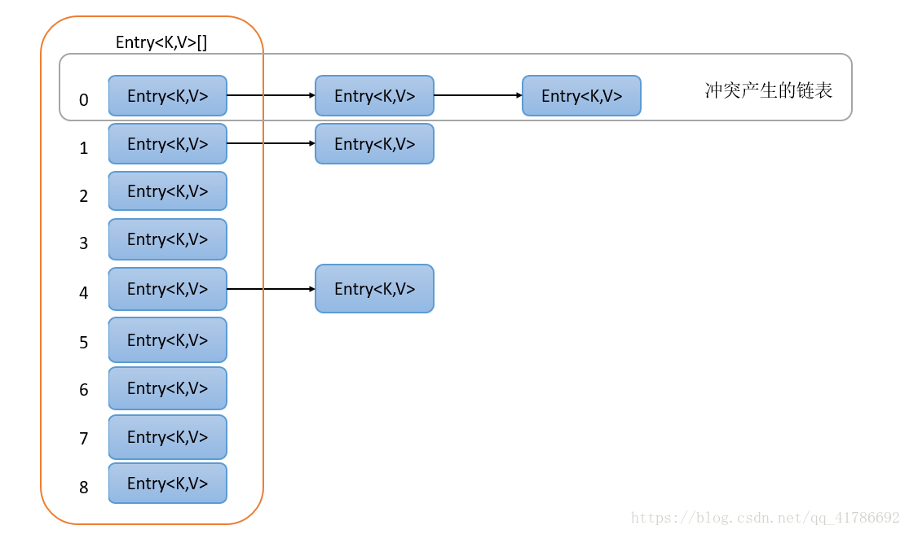
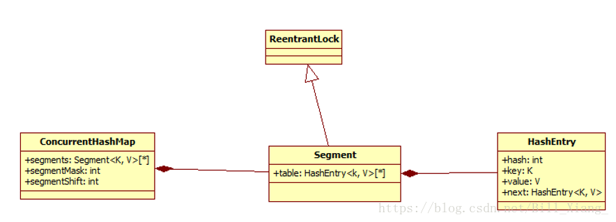

## 基本数据类型
JAVA提供了八种数据类型，6中数值类型（4个整型，2个浮点型）、一种字符型，一种布尔型。
|类型|字节|
-|-
|byte|1|
|short|2|
|int|4|
|long|8|
|float|4|
|double|8|
|boolean|一位|
|char|2|

## JAVA常量
常量在运行时是不允许被修改的。

在JAVA中使用`final`关键字修饰常量，如：
```
final double PI = 3.14
```

## final 关键字
final强调的是不可变

被final修饰的类不能被继承，被修饰的方法不能被重写，final修饰的变量，无论是类属性、对象属性、形参还是局部变量，都需要进行初始化操作。

## static
static作用于方法和属性上，强调不需要任何对象便可以访问。

## volatile关键字
[volatile原理](https://www.cnblogs.com/awkflf11/p/9218414.html)
[内存屏障](https://www.jianshu.com/p/64240319ed60)
表示每次访问变量时都从主存中取得，而不是从线程的工作内存中取得。通过lock保证了有序性

**不具有原子性**

**缓存一致性协议：每个处理器通过嗅探在总线上传播的数据来检查自己缓存的值是不是过期了，当处理器发现自己缓存行对应的内存地址被修改，就会将当前处理器的缓存行设置成无效状态，当处理器要对这个数据进行修改操作的时候，会强制重新从系统内存里把数据读到处理器缓存里。**

**所以，如果一个变量被volatile所修饰的话，在每次数据变化之后，其值都会被强制刷入主存。而其他处理器的缓存由于遵守了缓存一致性协议，也会把这个变量的值从主存加载到自己的缓存中。这就保证了一个volatile在并发编程中，其值在多个缓存中是可见的。**

## 自动类型转换
转换从低到高为
```
byte,short,char->int->long->float->double
```
- 不能对boolean类型进行转换
- 不能把对象类型转换成不相关类的对象
- 把容量大的类型转换成容量小的类型必须强制转换
- 可能溢出或者损失精度

## 抽象类和接口的区别
- 接口是公开的，不能有私有的方法和变量,接口中所有方法都没有方法体，通过关键字`interface`实现.
- 抽象类是可以有私有方法和私有变量的,通过把类或者类中的方法声明成`abstract`来表示类是一个抽象类，被声明为抽象的方法不能包含方法体,子类实现方法必须含有相同或者更低的访问级别,抽象类的子类为父类中所有抽象方法的具体实现，否则也是抽象类。
- 接口可以被看作是抽象类的变体，接口中所有的方法都是抽象的，可以通过接口来间接的实现多重继承。接口中的成员变量都是static final类型，由于抽象类可以包含部分方法的实现，所以，在一些场合下抽象类比接口更有优势。

 相同点：
 - 都不能被实例化
 - 接口的实现类或抽象类的子类都只有实现了抽象方法之后才能被实例化

 不同点：
 - 接口只能有定义，不能有方法的实现，而抽象类可以有定义与实现，方法可以在抽象类中实现。
 - 实现接口的关键字为`implements`，继承抽象类的关键字为`extends`。一个类可以实现多个接口，但一个类只能继承一个抽象类。所以，使用接口可以间接地实现多重继承。
 - 接口成员变量默认为`public static final`，必须赋初始值，且不能被修改，其所有的成员方法都是`public abstract`的，抽象类中成员变量默认为`default`, 可以在子类中重新定义，或者是重新赋值;抽象方法被`abstract`修饰，不能被`private static synchronized native`修饰。
 - 当一个类在初始化时，要求其父类已经初始化过了，但是一个接口在初始化时，并不要求父接口也初始化，真正用到的时候再初始化父接口

## 类类之间的关系
有继承、依赖、关联、聚合和组合
- 依赖关系是A类的方法中用到了B类，大多在JAVA中表现为局部变量，方法的形参,或者对静态方法的调用。这种使用关系是临时性的。但是B类的变化会很大程度上影响到A类。
- 关联关系体现在了类类之间，或者类和接口之间,一般这种关系是长期的，例如A类中有成员是B的一个实例，这就是关联关系。强调地位平等。
- 聚合关系是关联关系中的一个特例，聚合强调的是`has`,A类中可以有B类，也可以没有，B也是一个独立的实例，但是他们两个的关系不等，例如`class Family`中的`children`成员.
- 组合就是强聚合。强调A必须包含B。

在继承中，父类的内部细节在子类中是可见的，而聚合是通过现有的类去拼装产生新的功能，所以内部对象之间是不可见的。

继承一般都是在编译期间就已经确定了关系，而聚合可以在运行时再指定。

继承可以让父类引用子类对象，实现多态，而聚合则不能。所以继承主要体现的是一种回溯的思想，聚合体现的是一种整体和部分的思想。

[组合和继承思想](https://www.jianshu.com/p/edca9422b203)

## String类型为什么被final修饰
String类被`final`修饰，所以不能作为父类。
- 安全性：这设计到JVM的组成，JVM中拥有一块“本地方法栈”，其作用就是调用本地操作系统的API接口，而这些API是非常底层的，String类型中也使用到了。如果String开放继承，则开发人员通过继承之后重写方法便可以加入恶意代码。
- 方便性：设计成不可变时，有助于共享提高性能，可以将字符串对象存储在字符串常量池中。

所以在String类型中的方法，如substring、replace、toUpperCase等都是生成一个新的字符串。
```
因为使用了final关键字，JVM层面会直接优化成一个字符串字面量,
在字节码中s3就已经是ab了
final String s1 = "a";
final String s2 = "b";
String s3 = s1 + s2;
String s4 = "ab";
System.out.println(s3 == s4) // true
```

**String中的equals()函数会先比较是否为同一个对象，使用== 比较，再逐位比较**
[final 字符串比较](https://bbs.csdn.net/topics/392041804)

## StringBuffer和StringBuilder和StringJoiner
- StringBuffer是线程安全和同步的，StringBuilder不是线程安全的。
- StringBuffer的性能是低于StringBuilder的。
- 两者内部都是维护了一个可变长度的char[]，所以是可以指定的，当append时长度不够，会重新创建一个char[]进行复制。
- （线程安全方面待完善）Synchronized
- String类型的“+”操作是使用了StringBuffer进行的。返回转换类型的toString()
- 一个List中的字符串拼接，建议用StringJoiner

## ArrayList 和 LinkedList（相当于数组和链表的区别）
### ArrayList
长度是动态的，但是只能存储对象，不能存储原生数据类型如int。
- 底层是基于动态数组，根据下标随机访问数组元素效率高，想数组尾部添加效率高；删除数组中元素效率低，在数组中间添加元素效率低。当数组容量不够扩容时会arraycopy().

### LinkedList
基于链表的动态数组，数组添加和删除效率非常高。
- 查找访问效率低，只能遍历。

## 类初始化顺序
```
父类静态变量 -> 父类静态初始块 -> 子类静态变量 -> 子类静态初始块 ->
父类成员变量 ->父类非静态初始块 -> 父类构造器 -> 子类成员变量 ->
子类非静态初始块 -> 子类构造器
```

## Synchronized关键字 (实现原理待完善)
此关键字为同步关键字,在Java中，synchronized关键字是用来控制线程同步的，就是在多线程的环境下，控制synchronized代码段不被多个线程同时执行。
- synchronized 是不能被继承的，需要显式写出
- 修饰普通方法，此时锁的是当前实例对象,相当于`synchronized(this)`
```
public Synchronized void synMethod(){
  //do something
}
```
- 修饰静态方法，此时锁的是class对象,相当于`synchronized(this.class)`
```
public static synchronized void synMethod(){
  //do something
}
```

- 修饰同步代码块，此时锁的是括号里的对象,`synchronized(object)`
```
public void synMethod1(){
  synchronized (lock){
    //do something
  }
}
```

```
方法级的同步是隐式的。同步方法的常量池中会有一个ACC_SYNCHRONIZED标志。
当某个线程要访问某个方法的时候，会检查是否有ACC_SYNCHRONIZED，如果有设置，则
需要先获得监视器锁，然后开始执行方法，方法执行之后再释放监视器锁。这时如果其他
线程来请求执行方法，会因为无法获得监视器锁而被阻断住。值得注意的是，如果在方法
执行过程中，发生了异常，并且方法内部并没有处理该异常，那么在异常被抛到方法外面
之前监视器锁会被自动释放。

同步代码块使用monitorenter和monitorexit两个指令实现。可以把执行monitorente
r指令理解为加锁，执行monitorexit理解为释放锁。 每个对象维护着一个记录着被锁次
数的计数器。未被锁定的对象的该计数器为0，当一个线程获得锁（执行monitorenter
）后，该计数器自增变为 1 ，当同一个线程再次获得该对象的锁的时候，计数器再次自增
。当同一个线程释放锁（执行monitorexit指令）的时候，计数器再自减。当计数器为0的
时候。锁将被释放，其他线程便可以获得锁。
```
## HashMap 与 TreeMap 与 HashTable 与 ConcurrentHashMap
- Map是一个接口,是key-value键值对,一个map不能包含重复的key，并且每一个key只能映射一个value。
- Map接口提供了三个集合视图：key集合视图、value集合视图和key-value的集合。
- Map的具体实现中，HashMap允许存在null值，而HashTable的key值不允许为空，但是HashMap不能保证遍历元素的顺序，TreeMap能够保证遍历元素的顺序。
- HashMap（7和8的有不同）是数组+链表的实现结构(8中链表在超过阈值之后变成红黑树)，key值在加入时通过hash函数运算后得到散列值，再进行插入链表操作。
<div>

</div>

- **HashMap属于多线程不安全类型，典型的场景就是在扩容时，因为没有保障，容易访问到已经弃用的地址。或者出现死循环的情况.**

- TreeMap是一个有序的key-value集合，通过红黑树实现，根据映射的自然顺序进行排序.不安全。因为要实现有序，key所属的类必须要实现Comparable接口,如果没有，则需要传入一个比较器。
<div align=center>

</div>

- Hashtable线程安全类，不允许null,因为每一个方法都使用了synchronized关键字，所以效率低下。

### ConcurrentHashMap
 ConcurrentHashMap采用分段锁实现，**适合写多读少** 从而实现了线程安全，简而言之，ConcurrentHashMap在对象中保存了一个Segment数组，即将整个Hash表划分为多个分段；而每个Segment元素，即每个分段则类似于一个Hashtable；这样，在执行put操作时首先根据hash算法定位到元素属于哪个Segment，然后对该Segment加锁即可。因此，ConcurrentHashMap在多线程并发编程中可是实现多线程put操作。
<div align=center>

</div>

```
static final class HashEntry<K,V> {  
    final K key;  
    final int hash;  
    volatile V value;  
    final HashEntry<K,V> next;  
}
```

- (8)其节点中只有value不是`final`修饰的，这就说明在删除一个节点的时候，需要对整个链表(该节点前面的节点)进行操作，而且V是由`volatile`修饰，说明其可以一直获取到最新的值，在get操作时无需加锁。
- 扩容：扩容的时候首先会创建一个两倍于原容量的数组，然后将原数组里的元素进行再hash后插入到新的数组里。为了高效ConcurrentHashMap不会对整个容器进行扩容，而只对某个segment进行扩容。
- size（）：多次不加锁统计，有异常再进行加锁统计。

 [concurrentHashMap](https://blog.csdn.net/bill_xiang_/article/details/81122044)

 |名称|是否可以为空|默认大小|扩容方式|线程安全|
 -|-|-|-|-
 |hashtable|不可以|11|2*n+1|通过方法加锁保证|
 |hashMap|可以|16|2*n|不是线程安全|
 |TreeMap|不可以||不是线程安全|
 |concurrentHashMap1.7|不可以|默认16 | 申请一个原来大小两倍的空间，不需要重新hash，可以进行分段扩容|是线程安全|
 |concurrentHashMap1.8|不可以|默认16|当table数量小于64时，先进行扩容，如果大于，再转红黑树|线程安全|

JDK8的ConcurrentHashMap放弃了Segment加锁，使用了CAS+synchronized的方式来保证并发安全性。假设f为要被插入数据的节点，如果f为空的话，cas自旋插入，如果不为空的话对f加锁之后，对链表或红黑树进行操作。

 [JDK7/JDK8扩容方式](https://www.cnblogs.com/lfs2640666960/p/9621461.html)

 [JDK8 concurrentHashMap 操作](https://blog.csdn.net/jy02268879/article/details/88599830)

[concurrentHashMap transfer](https://www.cnblogs.com/menghuantiancheng/p/10462370.html)

## 反射
JAVA反射机制是在运行状态中，对于任意一个类，都能够知道这个类的所有属性和方法；对于任意一个对象，都能够调用它的任意一个方法和属性；这种动态获取的信息以及动态调用对象的方法的功能称为java语言的反射机制。

反射可以把一个java类中的各种成分映射成一个个的java对象，例如：一个类有成员变量、构造方法、包等信息，反射可以对一个进行解剖，把个个组成部分映射成一个个对象。

**JAVA反射机制跟JVM类加载过程有紧密关系**

- 获取方法时要传入方法名和参数类型
- 使用方法时要传入使用对象和参数

### 创建反射获取Class对象的三种方法
1. 使用`Class.forName`静态方法

2. 使用`.class`方法

3. 使用类对象的`getClass()`方法

### 获取对象实例的方法

直接用字节码获取文件
`Object o = clazz.newInstance();调用无参构造器`实际上，这个函数底层还是调用的Contructor对象的newInstance()

或者调用有参构造函数
```
//获取构造函数类的对象
Constroctor constroctor = clazz.getConstructor(String.class,Integer.class);

// 使用构造器对象的newInstance方法初始化对象
Object obj = constroctor.newInstance("龙哥", 29);
```
## Java内存模型
Java内存模型就是一种符合内存模型规范的，屏蔽了各种硬件和操作系统访问差异的，保证了Java程序在各种平台下对内存的访问都能得到一致效果的机制及规范。目的是解决由于多线程通过共享内存进行通信时，存在的原子性、可见性（缓存一致性）以及有序性问题。

原子性

CPU有时间的概念，会根据不同的调度算法进行线程调度。所以在多线程场景下，就会发生原子性问题。因为线程在执行一个读改写操作时，在执行完读改之后，时间片耗完，就会被要求放弃CPU，并等待重新调度。这种情况下，读改写就不是一个原子操作。即存在原子性问题。

缓存一致性

在多核CPU，多线程的场景中，每个核都至少有一个L1 缓存。多个线程访问进程中的某个共享内存，且这多个线程分别在不同的核心上执行，则每个核心都会在各自的caehe中保留一份共享内存的缓冲。由于多核是可以并行的，可能会出现多个线程同时写各自的缓存的情况，而各自的cache之间的数据就有可能不同。

有序性

除了引入了时间片以外，由于处理器优化和指令重排等，CPU还可能对输入代码进行乱序执行，比如load->add->save 有可能被优化成load->save->add 。这就是有序性问题。


Java内存模型规定了所有的变量都存储在主内存中，每条线程还有自己的工作内存，线程的工作内存中保存了该线程中是用到的变量的主内存副本拷贝，线程对变量的所有操作都必须在工作内存中进行，而不能直接读写主内存。不同的线程之间也无法直接访问对方工作内存中的变量，线程间变量的传递均需要自己的工作内存和主存之间进行数据同步进行。

### 内存模型的实现
原子性

在Java中，为了保证原子性，提供了两个高级的字节码指令monitorenter和monitorexit。在synchronized的实现原理文章中，介绍过，这两个字节码，在Java中对应的关键字就是synchronized。

因此，在Java中可以使用synchronized来保证方法和代码块内的操作是原子性的。

可见性

Java内存模型是通过在变量修改后将新值同步回主内存，在变量读取前从主内存刷新变量值的这种依赖主内存作为传递媒介的方式来实现的。

Java中的volatile关键字提供了一个功能，那就是被其修饰的变量在被修改后可以立即同步到主内存，被其修饰的变量在每次是用之前都从主内存刷新。因此，可以使用volatile来保证多线程操作时变量的可见性。

除了volatile，Java中的synchronized和final两个关键字也可以实现可见性。只不过实现方式不同，这里不再展开了。

 有序性

 在Java中，可以使用synchronized和volatile来保证多线程之间操作的有序性。实现方式有所区别：

volatile关键字会禁止指令重排。synchronized关键字保证同一时刻只允许一条线程操作。

## 动态代理
### JDK实现
[源码分析](https://www.cnblogs.com/zuidongfeng/p/8735241.html)

Java JDK的动态代理是通过反射机制实现的，要实现动态代理需要几个类：
- 抽象类接口
- 被代理类
- 动态代理类:需要继承`InvocationHandler`接口，并且重写`invoke`方法。

在people chinese InvocationHandle Proxy中，people是接口，chinese是被代理类，Handler是重写的函数方法，Proxy是代理类。

实现过程：
1. 通过`Proxy.newProxyInstance()`方法，返回一个继承`Proxy`类，并且最终实现了指定接口的代理类的实例。分为两步：（java动态代理的核心是Proxy.newProxyInstance(ClassLoader loader,Class<?>[] interfaces,InvocationHandler h)。用于生成代理对象。
  ClassLoader loader：用来指明生成代理对象使用哪个类装载器。
  Class<?>[] interfaces：用来指明生成哪个对象的代理对象（代理类和目标类需要实现相同的接口）
  InvocationHandler h：最后会调用到我们自定义的方法中。）
- 通过`getProxyClass`生成代理类，在这个方法中：
  - ProxyGenerator.generateProxyClass()的方法是最终生成代理类的字节码.
  - defineClass0()方法把相应的字节码生成代理类（**Class类没有public的构造方法，Class对象是在装载类时由JVM通过调用类装载器中的defineClass()方法自动构造的。**）
- 调用 newInstance(Constructor<?> cons, InvocationHandler h)方法 创建一个新的代理类实例，创建对象时，传入我们定义好的代理处理类，InvocationHandle类。
2. 调用新实例的方法，即此例中的add(), update()方法，即原InvocationHandler类中的invoke()方法。

优点：
- 最直观的，类少了很多
- 代理内容也就是InvocationHandler接口的实现类可以复用，可以给A接口用、也可以给B接口用，A接口用了InvocationHandler接口实现类A的代理，不想用了，可以方便地换成InvocationHandler接口实现B的代理
- 最重要的，用了动态代理，就可以在不修改原来代码的基础上，就在原来代码的基础上做操作，这就是AOP即面向切面编程

缺点：
- 动态代理的缺点，就是前面我们读源代码的时候遇到的。它只能针对接口生成代理，不能只针对某一个类生成代理。

[动态代理机制](https://blog.csdn.net/u013322876/article/details/76607845)

[动态代理-简书-超详细](https://www.jianshu.com/p/84ffb8d0a338)

### CGLIB实现
简单来讲该方法是通过继承实现的动态代理，所以`final`方法无法进行代理.
[CGLIB](https://www.cnblogs.com/CarpenterLee/p/8241042.html)


## 比较
```
Integer a = 127;
Integer b = 127;
Integer a1 = 128;
Integer b1 = 128;
int a2 = 127;
a==b true //-128到127的会利用常量池的的数据
a1==b1 false //使用new Integer
a == a2 false //Integer会拆箱为Int


String a = "a";
String b = "b";
String c = new String("a");
System.out.println(a.hashCode() == c.hashCode());//true
System.out.println(a == c); //false是否为同一个地址
System.out.println(a.equals(c)); //true


因为使用了final关键字，JVM层面会直接优化成一个字符串字面量,
在字节码中s3就已经是ab了
final String s1 = "a";
final String s2 = "b";
String s3 = s1 + s2;
String s4 = "ab";
System.out.println(s3 == s4) // true
```

## equals和hashcode
规范一：若重写equals(Object obj)方法，有必要重写hashcode方法,确保通过equals方法判断为两个相同的对象具有相同的hashcode返回值，简单的说“如果两个对象相同，则他们的hashcode相等”;

规范二：如果equals(Object obj)返回false，即两个对象“不相同”，并不要求对这两个对象调用hashcode()方法得到两个不相同的数。说的简单点就是：“如果两个对象不相同，他们的hashcode可能相同”。

### 为什么覆盖equals时总要覆盖hashCode
 一个很常见的错误根源在于没有覆盖hashCode方法。在每个覆盖了equals方法的类中，也必须覆盖hashCode方法。如果不这样做的话，就会违反Object.hashCode的通用约定，从而导致该类无法结合所有基于散列的集合一起正常运作，这样的集合包括HashMap、HashSet和Hashtable。

1.在应用程序的执行期间，只要对象的equals方法的比较操作所用到的信息没有被修改，那么对这同一个对象调用多次，hashCode方法都必须始终如一地返回同一个整数。在同一个应用程序的多次执行过程中，每次执行所返回的整数可以不一致。

2.如果两个对象根据equals()方法比较是相等的，那么调用这两个对象中任意一个对象的hashCode方法都必须产生同样的整数结果。

3.如果两个对象根据equals()方法比较是不相等的，那么调用这两个对象中任意一个对象的hashCode方法，则不一定要产生相同的整数结果。但是程序员应该知道，给不相等的对象产生截然不同的整数结果，有可能提高散列表的性能。

### 总结
1、equals方法用于比较对象的内容是否相等（覆盖以后）

2、hashcode方法只有在集合中用到

3、当覆盖了equals方法时，比较对象是否相等将通过覆盖后的equals方法进行比较（判断对象的内容是否相等）。

4、将对象放入到集合中时，首先判断要放入对象的hashcode值与集合中的任意一个元素的hashcode值是否相等，如果不相等直接将该对象放入集合中。如果hashcode值相等，然后再通过equals方法判断要放入对象与集合中的任意一个对象是否相等，如果equals判断不相等，直接将该元素放入到集合中，否则不放入。

## Java对象序列化
[序列化：把对象转换成字节序列的过程叫做序列化。](https://www.cnblogs.com/wxj-106/p/8075688.html)

当想把内存中对象状态保存到文件或者数据库中的时候，当需要通过网络传输对象的时候.

**注意**：
- 序列化的是对象，当类中有`static`变量时无法序列化
- `transient`修饰的也不能访问
- 如果某个类能够被序列化，其子类也可以被序列化。
- 父类不可序列化，如果要序列化子类，就需要一个可访问的父类无参构造函数
