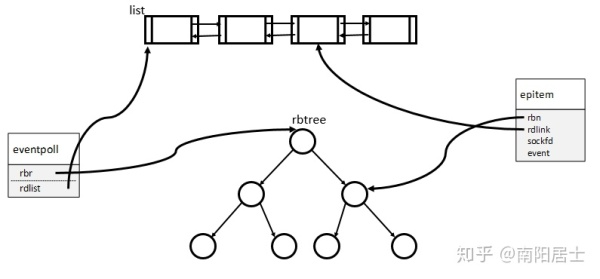

## IPC
IPC是指Inter-Process Communication，进程间通信，POSIX IPC是指由`POSIX.1b`设计来取代与之类似的`System V IPC`机制的三种IPC机制--消息队列、信号量以及共享内存。

### `POSIX`消息队列
- 引用计数，只用所有当前使用队列的进程都关闭了队列之后才会对队列标记删除。
- 消息之间按照严格的优先级进行排列。
- 在一条消息可用时可用异步通知进程。
- POSIX是在内核2.6.6之后才加入的。

---

### Epoll
[Select和Epoll的对比](https://www.zhihu.com/question/20122137/answer/146866418)

[复用、ETLT模型](https://zhuanlan.zhihu.com/p/87843750)

[EPOLL的惊群现象](https://blog.csdn.net/dog250/article/details/80837278)

[Epoll中函数调用](https://blog.csdn.net/daaikuaichuan/article/details/88770427)

属于IO多路复用技术的一种具体实现，以网络套接字为例，通过一个进程管理多个socket流，并且不占用额外的CPU轮询时间。

具体原理是：每收到一个套接字任务时将其放入一个epoll实例（eventpoll），这是由一个红黑树进行维护的(rbr),红黑树中的每个节点都是一个IO事件（epitem）。当一个IO事件准备就绪之后，回调函数会将其放入rdlist中，当epoll_wait()函数重新激活的时候，会将epitem逐一拷贝到events参数中。

与Select的对比，相比于Select，服务器每次都需要将所有的套接字都装入内核态轮询，这个操作的资源消耗比较大，epoll的解决方法是1.直接在内核态中创建一个属于epoll的高速缓冲区cache用来存储，避免了大量了内存复制。2.通过将就绪的套接字加入到rdlist中，当程序执行到epoll_wait时，如果rdlist已经引用了socket，那么epoll_wait直接返回（存在几个内存复制），如果rdlist为空，阻塞进程。

#### LT和ET的区别
Level Trigger水平触发模式和Edge Trigger边缘触发模式，主要针对的是两个event事件
EPOLLIN和EPOLLOUT的触发机制，在LT下，读写缓冲区是否变化都可以触发这两个事件，而在ET下，只有当读缓冲区有无到满（触发EPOLLIN），或者写缓冲区从满到无（触发EPOLLOUT）才会触发相应事件。

注意在Socket连接建立的时候，会触发EPOLLOUT事件，（不会触发EPOLLIN是因为建立连接的请求并不是发送到新建立的Socket上的，而是通过accept进行构建）。
在关闭连接的时候，会触发EPOLLOUT和EPOLLIN两个事件。所以总结如下：

- 在LT模式下EPOLLIN：
  - 当有新的数据写入读缓冲区时
  - 关闭连接的时候
- 在LT模式下EPOLLOUT：
  - 建立TCP连接的时候
  - 关闭连接的时候
  - 写缓冲区会一直触发
- 在ET模式下EPOLLIN：
  - 关闭连接的时候
  - 读缓冲区从无到有
- 在ET模式下EPOLLOUT：
  - 关闭连接的时候
  - 建立连接的时候
  - 写缓冲区从有到无

  

  
  

  

  
  

  [LT和ET的区别--图解](https://www.cnblogs.com/xiehongfeng100/p/4636118.html)

  [LT和ET的区别--代码](https://www.zhihu.com/question/47002053/answer/794254562)

  [EPOLLIN和EPOLLOUT的触发机制](https://cloud.tencent.com/developer/article/1481046)

[LT下一直触发写事件的解决办法](https://www.cnblogs.com/lchb/p/4895297.html)

  **注意：在accept阶段才会阻塞，并且该函数会返回一个新的套接字用于和客户端进行通信**

- `EAGAIN`错误会在读缓冲区无数据或者写缓冲区满时发生。
---

## 进程等待队列
进程进入等待（阻塞）状态的一种方法，Epoll也是使用这种技术在epoll_wait()没有任务
返回时阻塞的，它使用数据结构_wait_queue_head进行管理，每个要睡眠的进程就是其中的一个节点_wait_queue,设置了wake_up函数（在epoll中就是rdlist不为空）之后可以让进程进入休眠等待唤醒，这里存在两个回调函数，一个是socket完成之后epoll设置的回调，一个是对epoll_wait()唤醒的回调。
