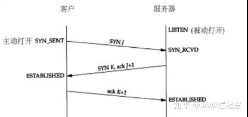

## TCP三次握手和四次挥手

三次握手过程描述
1. 由客户端发起一个SYN报文，并且指明客户端的初始化序列号ISN。此时客户端处于SYN_SEND阶段。
2. 客户端收到了SYN报文之后，会以自己的SYN报文作为答应，并且也是指定了自己的初始化序列号ISN。同时，把客户端传输来的ISN号+1作为一个ACK应答标志进行回传。此时服务器处于SYN_RECV阶段。
3. 客户端接收到了SYN报文之后，会发送一个ACK报文，会把服务器发送的ISN+1作为ACK，表示已经收到了，此时客户端就属于已连接状态了。
3. 服务器收到之后也进入连接状态。

#### 为什么是三次握手
第一次握手：客户端发，服务器收。

这样服务器就可以确定了客户端的发送能力和服务器的接收能力正常。

第二次握手：客户端收，服务器发。

这样客户端就可以确定客户端的发送能力和接收能力，服务器的发送能力和接收能力。

第三次握手：客户端发送，服务器接收。

这样服务器就可以确定客户端的接收能力正常和服务器的发送能力正常。

简单来讲就是一个全双工的建立过程。

#### 四次挥手过程描述
四次挥手两端都可以开启。（假如客户端发起）双方处于已连接状态
1. 客户端发送一个FIN报文，报文中会指定一个序列号。此时客户端处于FIN_WAIT1状态。
2. 服务器收到之后，发送一个ACK=ISN+1，表明收到FIN报文，此时处于CLOSE_WAIT状态。
3. 服务器在没有数据需要传输之后，发送一个FIN报文并且指定序列号，此时服务器处于LAST_ACK。
4. 客户端接收到并且返回ACK，并且处于TIME_WAIT状态。没事的话就CLOSE
5. 服务器收到ACK后进入CLOSE

**TIME_WAIT重点，这里有一个报文来回的等待时间，就是1为了防止第三次握手的丢失，
让服务器可以重发第三次握手，2让在此连接中的无效报文彻底失效。**

---
