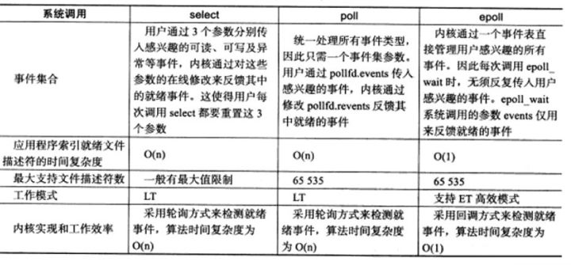

## IPC
IPC是指Inter-Process Communication，进程间通信，POSIX IPC是指由`POSIX.1b`设计来取代与之类似的`System V IPC`机制的三种IPC机制--消息队列、信号量以及共享内存。

### `POSIX`消息队列
- 引用计数，只用所有当前使用队列的进程都关闭了队列之后才会对队列标记删除。
- 消息之间按照严格的优先级进行排列。
- 在一条消息可用时可用异步通知进程。
- POSIX是在内核2.6.6之后才加入的。

### Epoll
属于IO多路复用技术的一种具体实现，以网络套接字为例，通过一个进程管理多个socket流，并且不占用额外的CPU轮询时间。

具体原理是：每收到一个套接字任务时将其放入一个epoll实例（eventpoll），每一个接受到的套接字都会放入eventpoll中，当套接字任务完成，就会开启中断执行程序，将该套接字任务加入等待队列rdlist中。

与Select的对比，相比于Select，服务器每次都需要将所有的套接字都装入内核态轮询，这个操作的资源消耗比较大，epoll的解决方法是通过将就绪的套接字加入到rdlist中，当程序执行到epoll_wait时，如果rdlist已经引用了socket，那么epoll_wait直接返回，如果rdlist为空，阻塞进程。

