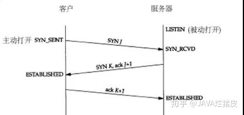
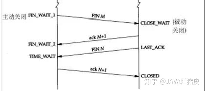

## TCP三次握手和四次挥手

三次握手过程描述
1. 由客户端发起一个SYN报文，并且指明客户端的初始化序列号ISN。此时客户端处于SYN_SEND阶段。
2. 客户端收到了SYN报文之后，会以自己的SYN报文作为答应，并且也是指定了自己的初始化序列号ISN。同时，把客户端传输来的ISN号+1作为一个ACK应答标志进行回传。此时服务器处于SYN_RECV阶段。
3. 客户端接收到了SYN报文之后，会发送一个ACK报文，会把服务器发送的ISN+1作为ACK，表示已经收到了，此时客户端就属于已连接状态了。
3. 服务器收到之后也进入连接状态。

#### 为什么是三次握手
第一次握手：客户端发，服务器收。

这样服务器就可以确定了客户端的发送能力和服务器的接收能力正常。

第二次握手：客户端收，服务器发。

这样客户端就可以确定客户端的发送能力和接收能力，服务器的发送能力和接收能力。

第三次握手：客户端发送，服务器接收。

这样服务器就可以确定客户端的接收能力正常和服务器的发送能力正常。

简单来讲就是一个全双工的建立过程。

#### 服务器啥时候进行三次握手
这里存在一个误区，并不是在`accept()`函数中进行三次握手的，而是在`listen()`中进行全部的三次握手，`accept()`中只是返回了已经建立好的，放在连接队列中的连接而已。

#### 四次挥手过程描述
四次挥手两端都可以开启。（假如客户端发起）双方处于已连接状态
1. 客户端发送一个FIN报文，报文中会指定一个序列号。此时客户端处于FIN_WAIT1状态。
2. 服务器收到之后，发送一个ACK=ISN+1，表明收到FIN报文，此时处于CLOSE_WAIT状态。
3. 服务器在没有数据需要传输之后，发送一个FIN报文并且指定序列号，此时服务器处于LAST_ACK。
4. 客户端接收到并且返回ACK，并且处于TIME_WAIT状态。没事的话就CLOSE
5. 服务器收到ACK后进入CLOSE

**TIME_WAIT重点，这里有一个报文来回的等待时间，就是1为了防止第三次握手的丢失，
让服务器可以重发第三次握手，2让在此连接中的无效报文彻底失效。**

---

## TCP可靠传输实现
#### 确认应答机制
每个数据报文的接收会发送一个ACK应答报文进行确认，应答报文中存在**超时重传机制** 和三个冗余ACK重传机制（快重传）

#### 流量控制（主要针对缓冲区的调整）
使用**滑动窗口**进行流量控制,防止分组丢失（以字节为单位，大小不清楚4096）：滑动窗口是无需等待应答报文就能发送的报文数量最大值。窗口大小会针对缓冲区动态调整。ACK报文是按照顺序发送的，接收到N的说明前面的已经收到完全了。ACK报文主要有两个作用：
- 提示下个应该接收的字节
- 提示滑动窗口的大小最大为$2^{16}$

[滑动窗口和拥塞窗口](https://www.cnblogs.com/findumars/p/9085494.html)

#### 拥塞控制
针对网络进行的优化，拥塞窗口大小是一次发送的TCP包的数量，慢启动、快恢复、快重传、拥塞避免。满启动的阈值为无穷大，拥塞窗口初始值为10。
- 拥塞窗口的大小为报文段的大小MSS。

[MSS MTU的关系](https://www.zhihu.com/question/48454744)

---

#### TCP_NODELAY
将Nagle算法关闭后,客户端每发送一次数据,无论数据包的大小都会将这些数据发送出去

TCP Delayed Acknoledgement 也是为了类似的目的被设计出来的，它的作用就 是延迟 Ack 包的发送，使得协议栈有机会合并多个 Ack，提高网络性能，是40ms。
[delayed ack也可以关闭](http://blog.chinaunix.net/uid-28387257-id-3658980.html)

Nagle’s Algorithm 是为了提高带宽利用率设计的算法，其做法是合并小的TCP 包为一个，避免了过多的小报文的 TCP 头所浪费的带宽。如果开启了这个算法 （默认），则协议栈会累积数据直到以下两个条件之一满足的时候才真正发送出 去：

1. 积累的数据量到达最大的 TCP Segment Size
2. 收到了一个 Ack

这两个组合会在write-write-read出现延迟问题[例子](https://blog.csdn.net/sunny_ss12/article/details/51509753)

---

### RTS报文
用于复位因为某种原因引起出现的错误连接，也用来拒绝非法数据和请求，发送RTS报文时如果发送缓冲区还有数据则放弃这些数据直接发送；接收RTS报文时如果还有ACK报文没发也不用发了。

产生RTS报文的几种情况：
- 目的地为某端口的SYN到达之后，该端口没有正在监听的服务器。
- 请求超时：体现在recv()的超时上，如果recv超时之后数据才到达会拒绝。
- 取消一个已经存在的连接。
- client和server在一方关闭了连接之后仍然受到数据（close和发送FIN——shutdown不同shutdown只是对一个方向的连接进行关闭，而close是双向的关闭）：假设客户端调用了close()，使用close后仍然会发送`FIN`段给server，但是此时client不能再通过此socket发送和接收数据，此时server调用read，如果接收到`FIN`段会返回0，但server此时还是可以write给client的，write调用只负责把数据交给TCP发送缓冲区就可以成功返回了，所以不会出错，而client收到数据后应答一个RST段，表示client已经不能接收数据，连接重置，server收到RST段后无法立刻通知应用层，只把这个状态保存在TCP协议层。（对于Linux下来说，无论是FIN还是RST，应用层read将会返回0，正是因为这样）如果server再次调用write发数据给client，由于TCP协议层已经处于RST状态了，因此不会将数据发出，而是发一个SIGPIPE信号给应用层，SIGPIPE信号的缺省处理动作是终止程序。当一个进程向某个已收到RST的套接字执行写操作时，（此时写操作返回EPIPE错误）内核向该进程发送个SIGPIPE信号，该信号的默认行为是终止进程，因此进程必须捕获它以免不情愿地被终止。

---

### SIGPIPE信号
该信号会在关闭连接后继续写入时触发，会导致进程终止，所以需要忽略该信号。

### Keepalive
TCP keepalive 有操作系统负责探查，即便进程死锁，或阻塞，操作系统也会如常收发 TCP keepalive 消息。对方无法得知这一异常.

---

#### TCP长连接分包
对于短连接来说，只要发送方主动关闭连接，就表示一条消息发送完毕，接收方read()返回0，从而知道消息的结尾。而对于长连接就需要分包，一般的分包有四种方法：
- 消息长度固定，例如规定16字节的长度。
- 使用特殊的字符或者字符串作为消息的边界，例如HTTP中的\\r\\n为字段的分隔符
- 在每条消息的头部加一个长度字段，最常见。
- 利用消息本身的格式进行分包，XML中的root配对，json中的{}配对。

---

## Google Protocol Buffer介绍
可以将其看做是一个数据化结构存储格式，将结构化数据序列化，它的特点是语言无关、平台无关，并且可以扩展，目前支持C++、Java、Python三种语言的API。[介绍](https://www.ibm.com/developerworks/cn/linux/l-cn-gpb/index.html)

以C++为例，使用时需要先设定其格式，再通过proto进行编译得到.h,.cpp文件，在使用时进行调用就好了。

---
## CDN协议
CDN是一个缓存机制，CDN服务器会部署在网络运营商的机房中，当用户访问CDN中的资源时便可以非常快速的获取到，CDN可以缓存javascrip脚本，css样式，图片，静态资源等。这些静态资源文件的访问频率很高，将其缓存在CDN可以极大地提高网站的访问速度，但由于CDN是部署在网络运营商的机房，所以在一般的网站很少用CDN加速。

---
