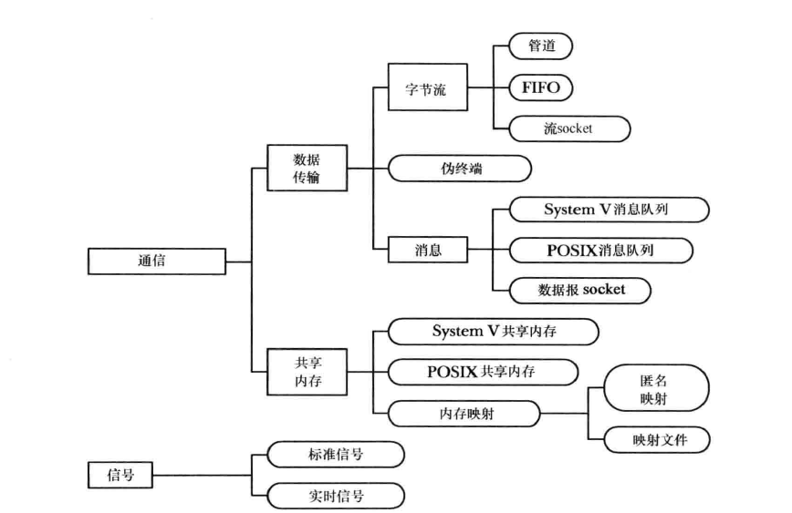
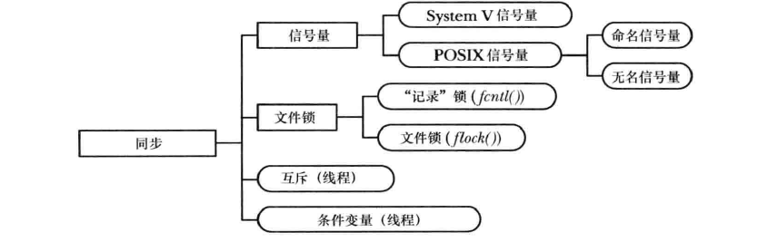
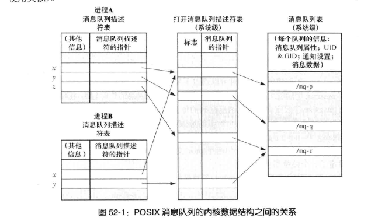

# 进程创建

#### fork、vfork、clone

fork：
创建新进程，分配新的地址空间。这两个进程拥有相同的文本段，不同的堆栈，数据段，会复制父进程的文件描述符，也会复制锁，所以可能导致死锁的发生。但是都只是先只读共享而已，表示进程的结构体task_struct会进行复制，再改变PID和标志。

vfork：
vfork是为了让子进程快速执行exec而专门设立的，vfork共享父进程的内存，知道其调用的exec，并且在这之前，将暂停执行父进程。exec是会启动参数指定的程序，代替自身进程。因为是共享的，如果在vfork和exec之间执行了修改代码，是可能引发段错误的。

clone：
可以选择继承父进程的某些资源，也可以改变继承关系，不复制进程的栈。

#### 僵尸进程和孤儿进程

父进程结束而子进程未结束的进程为孤儿进程，孤儿进程的getppid为1，init会接管所有的孤儿进程，他会wait掉所有的孤儿进程。

僵尸进程则是子进程已经执行结束，而父进程没有即时进行wait清理的进程，该进程唯一保留的是进程表中的记录，PID、终止状态等。这种状态仍然允许父进程进行wait()。


---

## 操作系统死锁
四个条件，缺一不可
1. 资源互斥，一个资源只能一个进程占有
2. 不可剥夺，进程获得资源后不可剥夺
3. 请求和保持，进程或者部分资源后，还在请求其他资源
4. 循环等待条件，存在一种进程资源的循环等待链，链中每一个进程已获得的资源同时被下一个进程所请求。

---

## 
用户态和内核态
用户态和内核态的概念其实是针对应用程序和操作系统而言的，CPU设置了权限等级并且想要保证安全，不能让应用程序完全支配所有东西，所以诞生了内核态和用户态这两个概念，内核态可以执行直接操作实际内存。而用户态向内核态的转变就是通过系统调用和中断进行的。

系统调用就是内核提供给上层的API接口，当程序使用一个系统调用时，会使处理器从用户态进入内核态，这样CPU就可以访问受保护的内核内存。从用户态到内核态大概有以下几步：
- 程序通过C库提供的包装函数来使用系统调用，像上面的mmap, brk其实都是C库的包装函数。
- 每一个系统调用都有一个编号，包装函数将参数和系统调用的编号拷贝到指定的寄存器。
- 包装函数执行一个80中断(int 0x80)或者sysenter，这使处理器从用户态切换到内核态，最终使内核调用system_call函数，该函数处理下面的事情：
  - 保存寄存器值到内核栈中。
  - 检查系统调用编号的合法性。
  - 通过sys_call_table表得到相应的系统服务函数，并调用之。
  - 函数完成后，从内核栈中恢复寄存器值，并将返回值放在用户栈上。
  - 返回到包装函数，同时从内核态返回到用户态。


## 进程调用
在进程切换的时候，首先会保存a的上下文，以便在切换回来的时候知道下一条指令是什么，然后将要运行的B进程的上下文恢复到寄存器中。这个过程被称为上下文切换。上下文切换开销在进程不多、切换不频繁的应用场景下问题不大。

- 切换页表全局目录
- 切换内核态堆栈
- 切换硬件上下文（进程恢复前，必须装入寄存器的数据统称为硬件上下文）
- 刷新TLB（TLB为虚拟地址到物理地址的加速装置）可以理解为页表地cache

上面属于硬性开销，在进程切换的时候也又非常多的其他开销。由于各种缓存并不热，速度运行会慢一些。如果进程始终都在一个CPU上调度还好一些，如果跨CPU的话，之前热起来的TLB、L1、L2、L3因为运行的进程已经变了，所以以局部性原理cache起来的代码、数据也都没有用了，导致新进程穿透到内存的IO会变多。

首先，进程是由内核来管理和调度的，进程的切换只能发生在内核态。所以，进程的上下文不仅包括了虚拟内存、栈、全局变量等用户空间的资源，还包括了内核堆栈、寄存器等内核空间的状态。因此，进程的上下文切换就比系统调用时多了一步：在保存内核态资源（当前进程的内核状态和 CPU 寄存器）之前，需要先把该进程的用户态资源（虚拟内存、栈等）保存下来；而加载了下一进程的内核态后，还需要刷新进程的虚拟内存和用户栈。


---

# 进程通信

- 通信：这些工具关注的是进程之间的数据交换。
- 同步：关注进程和线程操作之间的同步。

通信工具包括
<div align=center>

</div>
<div align=center>

</div>

其中信号也可以算是一种同步工具。

在通信工具中，可以分为数据传输工具和共享内存两种通信方法。

#### 传输工具
传输工具要求在用户内存和内核内存之间进行两次数据传输：一次传输是在用户写入数据时从用户内存到内核内存，另一次传输是在读取的时候从内核到用户内存。数据传输工具可以进一步分为下列的类别：
- 字节流：通过管道、FIFO以及数据报socket交换的数据是一个无分隔符的字节流，每一个读取操作都可以从缓冲区中读取任意数量的字节，不管写入者写入的块大小是多少。
- 消息：通过消息队列，数据报socket交换的数据是以分隔符分隔的数据，每次的读取都会读取由写入者写入的一整条消息，无法只读取部分消息。
- 共享内存方式分为POSIX共享内存和内存映射。在使用共享内存时需要注意：
  - 虽然共享内存的通信速度很快，但是在共享内存上的操作是需要同步信号的，例如在一个进程试图读取一段内存时，而这段内存在被另一个进程写入。
  - 放入共享内存的数据对所有共享这块内存的进程可见。

#### 同步工具
同步工具的诞生是为了在多进程或线程的环境下，在对同一块内存进行操作时不出现预期之外情况，导致程序错误。有以下同步工具：
- 信号量：是由内核维护的一个整数，其值永远不会小于0。一个进程可以增加或减小一个信号量的值。如果一个进程试图将信号量减小到小于0，那么内核会阻塞该操作直至信号量的值增长到允许执行该操作的程度（或者返回错误）。一个进程减小信号量是为了预约对某些资源的独占访问，在完成了资源的使用之后可以增加信号量的值。
- 文件锁：文件锁是为了协调多个进程操作同一文件时的同步方法。文件锁分为读锁和写锁，任何进程都有持有文件的读锁，但是当一个进程持有文件写锁时，其他进程就无法再获取读锁和写锁了。（文件锁的操作其实可以使用互斥量+智能指针更加高效的完成）
- 互斥体和条件变量：多用于线程同步。

数据传输工具和共享内存方式存在几种差别：
- 传输工具的读取操作是有消耗性的，读取操作会消耗数据，其他进程无法获取已经读取了的数据。
- 读取者和写入者之间的同步是原子的。如果一个读取者试图从一个当前不包含数据的数据传输工具中读取数据，那么在默认情况下读取操作会被阻塞直至一些进程向该工具中写入。

---

## Socket
套接字分为网络套接字和Unix域套接字，域套接字只能用于单机的进程间信息交互，因为其没有使用网络协议栈，所以不会有添加删除报文、计算校验和等操作，它做的只是数据复制。在选择时可以按照以下几点进行。
- 网络套接字不仅可以运行在相同主机上，还可以运行在网络上的不同主机上，这是最为重要的一点。
- 在一些实现中，Unix域套接字是会比网络套接字要快的。
- 可以使用目录权限来控制Unix域套接字的访问。

---

## IPC
IPC是指Inter-Process Communication，进程间通信，POSIX IPC是指由`POSIX.1b`设计来取代与之类似的`System V IPC`机制的三种IPC机制--消息队列、信号量以及共享内存。


### `POSIX`消息队列

- 引用计数，只用所有当前使用队列的进程都关闭了队列之后才会对队列标记删除。
- 消息之间按照严格的优先级进行排列。
- 在一条消息可用时可用异步通知进程。具体为当一个为空的消息队列中有可读的消息时，会有可读的异步通知，这样就不用执行阻塞调用或者mq_receive()。
- POSIX是在内核2.6.6之后才加入的。

消息队列是使用描述符进行操作的，消息队列描述符和打开着的消息队列之间的关系与文件描述符和打开的文件之间的关系相似。如图：

<div align=center>

</div>

- 两个进程能够同时持有引用同一个打开的消息队列的消息队列描述符（图中的x），这在fork中会表现出来。
- 两个进程能够持有引用不同消息队列描述的打开的同一个消息队列的描述符。如图中的z和y。


```
打开消息队列
mq_open()函数创建一个新的消息队列或者打开一个既有队列。

关闭消息队列只是关闭进程操作的消息队列的描述符。
int mq_close(mqd_t mqdes);


真正删除一个消息队列，发生在所有进程使用完该消息队列后。
int mq_unlink(const char* name);

发送消息
int mq_send(mqd_t mqdes, const char* msg_ptr, size_t msg_len,
            unsigned int msg_prio);

接收消息会从消息队列中取出一个优先级最高、存在时间最长的消息进行删除。
如果消息队列为空，该操作会阻塞，如果设置为非阻塞的话会返回错误。
int mq_receive(mqd_t mqdes, char* msg_ptr, size_t msg_len,
              unsigned int *msg_prio);

通知消息
int mq_notify(mqd_t mqdes, const struct sigevent *notification)
```

跟System V消息对比，优势有：
- 允许在消息队列状态由空变为有时异步通知一个进程，但是存在诸多限制。
- 可以使用epoll等对其进行监控。

不足有：
- 可移植性稍差。
- 严格按照优先级进行排序，System V可以根据类型来选择消息的功能。

### `POSIX`信号量
信号量可以分为命名信号量和未命名信号量，允许进程或线程同步对共享资源的访问。信号量如果要在进程间共享的话需要创建在共享内存区域中（POSIX共享内存对象，mmap()创建的内存映射，或者System V的共享内存段），子进程可以继承这种共享区域的信号量访问。
```
命名信号量操作：
sem_open()打开或创建一个信号量并返回一个句柄以供后续调用使用，如果创建了
信号量则对所创建的信号量进行初始化。

sem_post()和sem_wait()函数分别递增和递减一个信号量值。
sem_getvalue()获取一个信号量的当前值
sem_close()删除进程和信号量的关联关系
sem_unlink()在所有进程关闭该信号量时删除该信号量。
```

与System V的比较，优势：
- 操作简单。
- 没有System V的初始化问题
- 未命名信号量与动态分配的内存对象关联更加简单
- POSIX只有在发生资源争夺的时候才需要执行系统调用，而System V信号量操作则不管是否发生了争夺都会执行系统调用。

与互斥体比较，Mutex可以让代码保持一个良好的结构性，只有锁住互斥体的线程才能解锁。

### POSIX共享内存
POSIX共享内存可以让无关进程共享一个映射区域而无需创建一个相应的映射文件。操作步骤为：
- 使用`shm_open()`函数打开一个与指定名字对应的对象，该函数会创建一个共享对象并返回一个引用该对象的文件描述符。
- 将文件描述符传入mmap()并指定MAP_SHARED，将共享内存映射进进程的虚拟地址空间，一旦映射之后就可以关闭文件描述符。在这之前需要使用ftruncate()设置该对象的大小。

与System V的差异
- System V的共享内存在创建时就会规定大小，而POSIX的可以使用ftruncate()进行改变再重新映射。
- System V使用了自己的键和标识符模型，需要单独的系统调用，POSIX是使用名字和文件描述符的，所以Unix系统中都可以查看。
- POSIX创建的共享对象会在底层创建一个磁盘文件。
