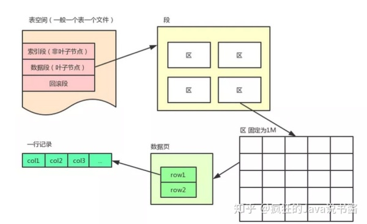
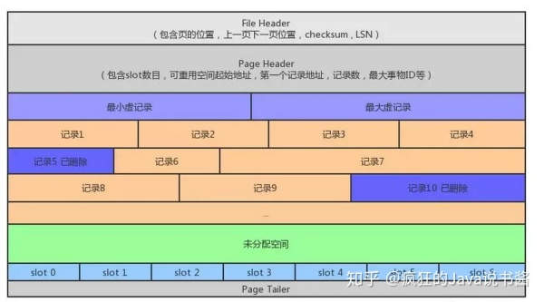
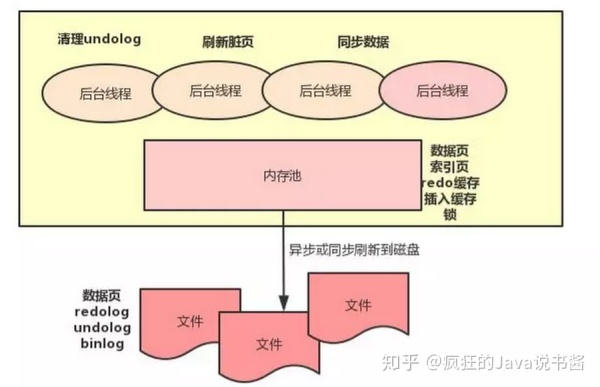

## 
 数据库基础 

### 主键（Primary key）
主键称为主键约束，在表中是一个列或者列的组合，其值能唯一地标识表中的每一行（unique性质）。
- 每个表中只能包含一个主键；
- 主键值唯一标识表中的每一行，且不能为NULL，即表中不能存在有两行数据相同的主键值，这是唯一性原则；
- 一个列名只能在复合主键中出现一次；
- 复合主键不能包含不必要的列。当把复合主键的某一列删除后，如果剩下的列构成的主键仍然满足唯一性原则，那么这个复合主键是不正确的。这是最小化原则。
- 主键还包含索引性质。
### 唯一键（Unique key）
唯一键可以唯一标识数据库中的每条记录，不同于主键，Unique key在一个表中可以有多个，Unique key会在此列建立一个index。
#### 注意
唯一键值可以为空（即为不填），当不填时，index中便不会有此项，所以在检索时会变慢。

### 外键（Foreign key）
外键的存在会使主表在插入值时进行验证，只有在从表中存在的值才会被成功插入，同理，如果想删除从表中的值，必须先删除主表中相应的值。

---

### 索引
索引的提出是为了加快数据的查询速度，索引分单列索引和组合索引，一个表中可以包含多个单列索引，组合索引的意思是一个索引中包含多个列。实际上，索引也是一张表，并且保存了主键和索引字段，所以这就会造成在更新时的速度降低，当对表进行Insert,update,delete等操作时，不仅要操作原表，也要对索引表进行操作。

**数据库的存储单位是磁盘中的页，这样的设计也是方面在进行磁盘IO时的操作，当一个表中没有建立索引时，其查询是逐个表进行查找的，会消耗线性时间**。

#### 索引原理
磁盘IO时非常耗时的操作，因此在进行磁盘IO时，不光会读取目标地址的数据，也会读取其相邻的数据，这是因为局部预读性原理。但是查询重视伴随着磁盘IO操作，所以我们的目标是尽量少的进行磁盘IO操作，因此索引的数据结构便是使用B+树和哈希进行实现。

##### 最左匹配原理
这是相对于联合索引而言的。**数据库会按照联合索引的顺序建立搜索表**，在查找数据时数据库会按照联合索引中的顺序从左到右进行匹配，当中间有条件缺失或者不确定时（大于符号等）会停止匹配。
- 最左前缀匹配原则，非常重要的原则，mysql会一直向右匹配直到遇到范围查询(>、<、between、like)就停止匹配，比如a = 1 and b = 2 and c > 3 and d = 4 如果建立(a,b,c,d)顺序的索引，d是用不到索引的，如果建立(a,b,d,c)的索引则都可以用到，a,b,d的顺序可以任意调整。
- =和in可以乱序，比如a = 1 and b = 2 and c = 3 建立(a,b,c)索引可以任意顺序，
mysql的查询优化器会帮你优化成索引可以识别的形式。

##### 全文索引（带完善）

注意事项：
- MySQL 5.6 以前的版本，只有 MyISAM 存储引擎支持全文索引；
- MySQL 5.6 及以后的版本，MyISAM 和 InnoDB 存储引擎均支持全文索引;
- 只有字段的数据类型为 char、varchar、text 及其系列才可以建全文索引。
- MySQL 中的全文索引，有两个变量，最小搜索长度和最大搜索长度，对于长度小于最小搜索长度和
大于最大搜索长度的词语，都不会被索引。通俗点就是说，想对一个词语使用全文索引搜索，那么
这个词语的长度必须在以上两个变量的区间内。

#### B+树索引
B+树属于平衡树，普通树会在极端情况下退化成线性链表，而B+树采用了额外的操作保证了其
左右子树的高度差不会超过1.因此会在插入和更新时增加耗时，B+树只会在叶子节点上存储数据，
并且作为叶子节点的页会形成一个双向的循环链表，**这样做的目的是提升模糊查询时的速度**。
- B+树索引在遇到=,>,>=,<,<=等操作时是可以使用索引搜索的。
- like也可以使用，只要最开始不是以通配符开始的。

##### MyISAM引擎（非聚集索引）
这种索引方式的索引文件和数据文件是分离的，索引文件仅仅保留数据记录的地址。若以这个引
擎创建数据库表（user），它实际上会生成3个文件：
- user.myi 索引文件
- user.myd 数据文件
- user.frm 数据结构类型

当运行 `select * from user where id = 1`它的实际执行流程如下：
- 1. 查看该表的myi文件有没有以id为索引的索引树。
- 2. 根据这个id找到叶子节点的id值，从而得到里面的数据地址。
- 3. 根据数据地址去myd文件中找到对应的数据返回出来。

##### Innodb引擎（聚集索引）
聚集是相对MyISAM引擎而言的，若使用这个引擎创建数据库表（user），它实际上会生成两个文件：
- user.idb 索引文件
- user.frm 数据结构类型

因为在Innodb中，创建表默认以主键为索引（没有主键则寻找满足的列，没有满足的列会自动生成），所以不需要myi文件。此时如果在name字段建立一个索引，其会以name字段为索引值生成一个索引树，`select * from user where name = '吴磊'`时：
- 1. 找到name索引树。
- 2. 根据name的值找到该索引树下的name索引和主键值。
- 3. 通过主键值去主键索引树去叶子节点找到该条信息。

#### 哈希索引
哈希索引就是把索引值通过哈希函数映射成为一个新的哈希值，检索时不需要像B+树一样从根节点到叶子节点逐级查找，只需要一次哈希算法便可以定位到相应的位置，速度非常快。但是缺点也显而易见：
- 哈希索引没有办法通过索引完成排序。
- 不支持最左匹配原则。需要全部使用。
- 冲突在极端情况下是会造成查找时间线性的。
- 哈希值虽然是按照顺序排列，但是实际数据并不是按照顺序排列，所以无法加速排序操作。

##### 覆盖索引
覆盖索引（convering index）指一个查询语句的执行只用从索引中就能够取得，不必从数据表中取得。如表中有提个索引idx_key1_key2(key1,key2)，当我们使用SQL语句:`select key2 from table where key1=""`就可以通过覆盖索引，无需回表。

### MySQL5.6的索引更新
索引下推技术：可以在有like查询条件下，减少回表的次数。索引下推一般可用于所求查询字段（select列）不是/不全是联合索引的字段，查询条件为多条件查询且查询条件子句（where/order by）字段全是联合索引。我们一般使用explain来查看语句是否使用索引
#### 参考资料
- [索引介绍/基本操作](https://www.runoob.com/mysql/mysql-index.html)
- [最左匹配原则](https://www.jianshu.com/p/b7911e0394b0)
- [B+树删除操作](https://www.cnblogs.com/wade-luffy/p/6292784.html)
- [哈希索引和B+树索引的区别](https://www.cnblogs.com/zhidongjian/p/10414129.html)
- [MyISBM和Innodb的区别](https://www.cnblogs.com/wlwl/p/9465583.html)

---
### 锁
- 排他锁：（写锁）简称X锁，事务T对数据对象A加上了排他锁，则只允许T读取和修改A，直到T释放A上的锁。
- 共享锁：（读锁）简称S锁，事务可以对一个加了S锁的对象再加S锁，但是不能加X锁。

---
### 事务
#### 事务特性
- 原子性(A)：事务时最小单位，不可再分的。
- 一致性( C): 事务要求所有的DML语句在操作的时候，要么同时成功，要么同时失败。
- 隔离性(I): 事务A和事务B直接具有隔离性。
- 持久性(D): 是事务的保证，事务终结的保证（内存的数据持久到硬盘文件中）。

#### 事务属性
- 事务是一个最小的，不可再分的工作单元；通常事务对应一个完整的业务功能
- 一个完整的业务需要批量的DML（insert、update、delete）语句共同完成
- 事务只和DML语句有关，或者说DML语句才有事务。这个和业务逻辑有关，业务逻辑不同，DML语句的个数也不同

#### 事务的隔离级别
在这之前需要先了解几种读取情况：
- 脏读：一个事务在处理的过程中读取了另外一个事务未提交的改动。
- 不可重复读：记录（一行或多行）的值在同一次事务中出现两个不同的结果。不同的结果。
- 幻读：同一事务中查询两次得到两个不同的结果集。侧重于多或者少。

MVCC概念：

英文全称为Multi-Version Concurrency Control,翻译为中文即 多版本并发控制。
Innodb实现MVCC的方法是对每一行数据增加了创建时间和删除时间进行控制。

read view其实就是一个保存事务ID的list列表。记录的是本事务执行时，MySQL还有哪些事务在执行。

- Read Repeatable(下文和图中用RR表示)对应的是在每个事务启动的时候创建 一个Read View。

- Read Commit(下文和图中用RC表示)对应的是每次执行SQL statement时候创建 一个Read View。

1. 串行化(Serializable):花费最高的代价但是是最可靠的事务隔离级别。

读写都会增加排他锁，后面的事务必须等到前面的事务操作完成之后才能进行。事务之间100%进行隔离。**对操作的整张表增加排他锁，直到事务提交**

2. 可重复读(Repeatalbe read):默认的隔离级别，当事务A在读取一条数据之后，此时事务B对数据进行了修改并提交，当事务A再读取时，读取到的还是原来的内容。不能避免幻读，但是可以避免脏读和不可重复读。**在读取之前（不是在事务开始时）增加一个ReadView，后面就一直沿用（但是在修改时可见）**

3. Read committed(读已提交):保证一个事务提交之后才能被另外一个事务读取。另外一个事务不能读取该事务未提交的数据。可避免脏读的发生，但是可能会造成不可重复读。**每次读的时候生成一个ReadView**

实现RC的原理排他锁和MVCC， 写时加入排他锁直到事务结束，读时通过MVCC，访问创建版本最大和删除版本为空的记录，针对事务T1和T2

| T1 | T2 |
-|-
| 查询得到1 | |
| | 修改|
|再次查询得到1| |

（1） 当T1进行查询的时候，

4. Read uncommitted(读未提交):最低的事务隔离级别，一个事务还没有被提交时，它做的变更就能被其他事务看到。任何情况都可能发生。

实现RU的原理是通过增加排他锁进行的，针对事务T1和T2

| T1 | T2 |
-| -
| 查询得到1 | |
| | 修改|
|再次查询得到2| |

（1） 当T1进行查询的时候，并未加任何锁，因此T2可以对数据做修改或查询；

（2） 当T2对数据进行修改时，对数据添加排他锁，完成之后**立即释放**；

（3） 当T1再次查询时，未加任何锁，便会产生脏读；

##### RR等级对幻读的解决
###### 预备知识
- 行锁(Record lock)：单个行记录上的锁；阻塞对行的读写。
- 间隙锁(Gap lock): 锁定索引记录间隙（索引值在某两个索引间隙之间却不存在对的情况），确保索引记录的间隙不变；
- Next-key lock：行锁和间隙锁结合，锁定这个范围的间隙和之间的索引值；

Next-key lock的出现就是为了解决幻读的问题，在操作时加上此锁不允许其他事务进行读写，避免了幻读的情况发生。

#### 参考资料
- [MVCC和ReadView](http://ju.outofmemory.cn/entry/99676)

---
### 数据库格式
InnoDB存储引擎的逻辑存储结构从大到小依次是表空间、段、页、区、行。

#### 行格式

- **变长字段长度列表**：该位置用来存储所申明的边长字段中，非空字段实际占有的长度, 例如有三个非空字段,第一个字段长度为3，第二个字段为空,第三个字段为1,则将用01、03标识，为空字段将在下一位置标记，变长字段长度不能超过两个字节，所以varchar 最大长度为65535
- **NULL标志位**：占一个字节，如果列为空则在对应位置上标1，否则标0
- **记录头信息**：固定5个字节，包含下一条记录的位置，该行记录总长度，记录类型，是否被删除，对应的slot信息。
- **列数据**：包含具体的列对应的值，加上两个隐藏的列.

我们需要了解数据页才能直到数据库是怎么从一个数据页中定位到一个数据行中的。因为数据页才是存储引擎管理的最小存储单位，索引只能帮我们定位到某一个数据页。每一次磁盘读写的最小单位也是数据页。

- **文件头**(File Header)：固定38个字节，(页的位置，上一页下一页位置，检查和)
- **数据页头**（page Header）：固定56个字节，包含slot数目，可重用空间起始地址，第一个记录地址、记录数、最大事务ID
- **虚拟的最大最小记录**（Infimum + Supremum record）：
- **用户记录** （User Records）:包含已经删除的记录以链表的形式构成可重用空间
- **待分配空间** （Free spaces） 未分配的空间
- **页目录** （Page Directory） slot 信息，下面单独介绍
- **文件尾**（File Trailer） 固定8个字节,用来保证页的完整性

页目录里维护多个 slot ，一个 slot 包含多个行记录。每个 slot 占 2 个字节，记录这个 slot 里的行记录相对页初始位置的偏移量。由于索引只能定位到数据页，而定位到数据页内的行记录还需要在内存中进行二分查找，而这个二分查找就需要借助 slot 信息，先找到对应的 slot ，然后在 slot 内部通过数据行中记录头里的下一个记录地址进行遍历。每一个 slot 可以包含 4 到 8 个数据行。如果没有 slot 辅助，链表本身是无法进行二分查找的。
-[数据库页和行结构](https://www.zhihu.com/search?type=content&q=MySQL)

---

### InnoDB存储模型
InnoDB 通过一些列后台线程将相关操作进行异步处理，如下图所示，同时借助缓冲池来减小 CPU 和磁盘速度上的差异。当查询的时候会先通过索引定位到对应的数据页，然后检测数据页是否在缓冲池内，如果在就直接返回，如果不在就去聚簇索引中通过磁盘 IO 读取对应的数据页并放入缓冲池。一个数据页会包含多个数据行。缓存池通过 LRU 算法对数据页进行管理，也就是最频繁使用的数据页排在列表前面，不经常使用的排在队尾，当缓冲池满了的时候会淘汰掉队尾的数据页。从磁盘新读取到的数据页并不会放在队列头部而是放在中间位置，这个中间位置可以通过参数进行修。缓冲池也可以设置多个实例，数据页根据哈希算法决定放在哪个缓冲池。

InnoDB 在更新数据的时候会采用 WAL 技术，也就是（提前写入日志） Write Ahead Logging ，这个日志就是 redolog 用来保证数据库宕机后可以通过该文件进行恢复。这个文件一般只会顺序写，只有在数据库启动的时候才会读取 redolog 文件看是否需要进行恢复。该文件记录了对某个数据页的物理操作，例如某个 sql 把某一行的某个列的值改为 10 ，对应的 redolog 文件格式可能为：把第5个数据页中偏移量为99的位置写入一个值 10 。redolog 不是无限大的，他的大小是可以配置的，并且是循环使用的，例如配置大小为 4G ，一共 4 个文件，每个文件 1G 。首先从第一个文件开始顺序写，写到第四个文件后在从第一个文件开始写，类似一个环，用一个后台线程把 redolog 里的数据同步到聚簇索引上的数据页上。写入 redolog 的时候不能将没有同步到数据页上的记录覆盖，如果碰到这种情况会停下来先进行数据页同步然后在继续写入 redolog 。另外执行更新操作的时候，会先更新缓冲池里的数据页，然后写入 redolog ， 这个时候真正存储数据的地方还没有更新，也就是说这时候缓冲池中的数据页和磁盘不一致，这种数据页称为脏页，当脏页由于内存不足或者其他原因需要丢弃的时候，一定要先将该脏页对应的redolog 刷新到磁盘里的真实数据页，不然下次查询的时候由于 redolog 没有同步到磁盘，而查询直接通过索引定位到数据页就会查询出脏数据。redolog是重复写。       

更新的时候先从磁盘或者缓冲池中读取对应的数据页，然后对数据页里的数据进行更改并生成 redolog　到对应的缓冲池（redolog buffer）进行缓存，当事务提交的时候将缓存写入到　redolog　的物理磁盘文件上。

---
### 配置参数
- **innodb_file_per_table**:配置了该项则每张表都会存储在一个单独的表空间中，没有配置的话默认共享表空间。
- **innodb_page_size**：区在任何时候都是固定为1M。一个区中有多个页，每个页默认为16kb,可以通过参数设置。
- 列的数量不能超过255
- **max_length_for_sort_data**:排序时不取出所有select的字段，而是排序好之后再取出，使用时间换取空间。
- **sort_buffer_size**:控制是否需要借助文件进行归并排序。
- **redolog**:大小可以配置。这个日志就是 redolog 用来保证数据库宕机后可以通过该文件进行恢复。
- **innodb_flush_log_at_trx_commit**：是否在提交的时候强制刷盘，默认为 1 ，事务每次提交都需要调用 fsync 进行刷盘，0 表示事务提交的时候不会调用 redolog　的文件写入，通过后台线程每秒同步一次，2 表示事务提交的时候会写入文件但是只保证写入操作系统缓存，不进行 fsync 操作。redolog 文件只会顺序写，所以磁盘操作性能不会太慢，所以建议生产环境都设置为　１　，以防止数据库宕机导致数据丢失。
