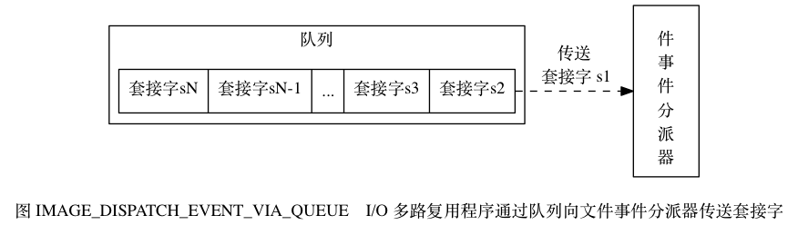

## 读写键空间的额外操作
- 读取之后，服务器会根据键是否存在来更新服务器的键空间命中次数（hit）或键空间不命中次数（miss）。
- 在读取一个键之后，服务器会更新键的LRU（最后一次使用时间），这个值可以用来计算键的闲置时间，使用`OBJECT idletime <key>`可以查看键的闲置时间。
- 服务器读取键是发现键过期后，会先删除该键再进行后续操作。
- 如果有客户通过`WATCH`命令坚实了某个键，那么服务器在对被监视的键进行修改之后，会将这个键标记为脏`dirty`,从而让事务程序注意到这个键已经被修改过。
- 脏值增加，持久化和复制操作。
- 数据库通知。

## 键的生存时间
通过`EXPIRE`或者`PEXPIRE`设置生存时间

通过`EXPIREAT`或者`PEXPIREAT`设置UNIT时间戳的过期时间

这些过期时间都存在了过期字典中(expire字典)，删除策略有三种：
- 定时删除：通过定时器保证键一旦过期就被删除
  - 优点：减少内存消耗
  - 缺点：删除过期键的这一行为会消耗CPU，浪费时间在与当前任务无关的过期键上，会对吞吐量造成影响。
- 惰性删除：只会在取出键时才会对键进行过期检查，保证了CPU时间，对内存不友好。可以看做是内存泄漏。
- 定期删除：定期删除每隔一段时间执行一次删除过期键的操作， 并且限制删除操作执行的时长和频率来减少删除操作对CPU时间的影响。Redis通过结合惰性和定期进行键删除。

## AOF、RDB和复制功能对过期键的处理
生成RDB文件时，不会保存过期的键，载入RDB文件时，主服务器不会载入过期的键，从服务器会载入所有键，但是在同步时会删除过期键所以不造成影响。

AOF文件在处理过期键时会在末尾追加`DEL`命令，重写时不会写入过期键。

## RDB持久化
RDB持久化是将Redis在内存的数据库状态保存到磁盘里面，避免数据意外丢失，RDB文件是一个经过压缩的二进制文件，通过该文件可以还原生成RDB文件时的数据库状态。

命令：`SAVE`和`BGSAVE`

前者会阻塞Redis服务器进程，直到RDB文件创建完毕，而后者会将任务指派给一个子进程进行处理。RDB文件会在启动的时候自动载入。RDB可以自动间隔保存。

可以设置RDB的保存条件，如在900秒内进行了3次修改就进行保存。并且有`dirty`记录了上次保存之后的修改次数和`lastsave`上次保存的时间戳。

**针对采用子进程的方式进行更新的同时，如果父进程出现了写任务的话，会采用写时复制策略（Linux进程策略），在子进程完成后进行更新。**

## AOF持久化
通过监听服务器中所执行的写命令来记录数据库状态，每次更新会在`aof_buf`中缓存更新命令，使用`fsync和fdatasync`控制不进入缓存区而是直接写入磁盘文件，具体更新到AOF文件中的时机由配置决定，分为`always everysec no`，当为always时更新的频率最高并且是最安全的，当为everysec的时候可能会丢失一秒钟的更新。no模式的话需要操作系统控制。

AOF重写目的是简化AOF中的命令，但是实际操作是通过读取服务器当前的数据库状态来实现的：从数据库中读取键现在的值，然后用一条命令去记录键值对，代替之前记录这个键值对的多条命令。`BGREWEITEAOP`,在子进程进行AOF重写时，父进程更新时会新建一个AOF重写缓冲区来达到数据一致。

## 事件
Redis服务器是事件驱动，文件事件和时间事件。文件事件使用I/O多路复用来同时监听多个套接字，并根据套接字目前执行的任务来为套接字关联不同的时间处理器。

文件事件处理器由套接字、I/O多路复用程序、文件事件分派器（dispatcher），以及事件处理器组成，文件事件是对套接字操作的抽象，每当一个套接字准备好执行连接应答、写入、读取、关闭等操作时，就会产生一个文件事件。因为一个服务器通常会连接多个套接字，所以多个事件可能会并发地出现。

I/O多路复用程序总是会将所有产生的事件的套接字都放到一个队列里面，然后通过这个队列，以有序、同步、每次一个套接字的方式向文件事件分派器传送套接字。当上一个套接字产生的事件被处理完毕之后，I/O多路复用程序才会继续向文件分派器传送下一个套接字。

#### 时间事件
所有时间事件都放在一个无序链表汇中，每当时间事件执行器运行时，它就遍历整个链表，查找所有已到达的时间事件，并调用相应的事件处理器。当时间事件执行器运行时，必须遍历所有的时间事件，才能确保处理。

**因为时间事件的处理在文件事件后面，所以时间事件可能会有延迟**
serverCron：
- 更新服务器的各类统计信息，比如时间、内存占用、数据库占用情况。
- 清理数据库中过期键值对。
- 关闭和清理连接失效的客户端。
- 尝试进行AOF和RDB持久化操作。
- 如果服务器是主服务器，那么对从服务器进行定期同步。
- 如果处于集群模式，对集群进行定期同步和连接测试。
