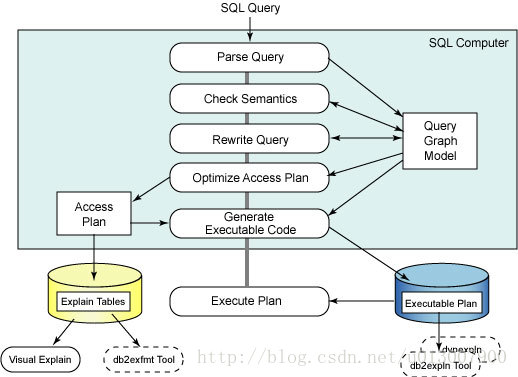

# 1.数据查询过程

SQL执行流程大致如下

- 语法分析（Parse Query）：SQL语句被提交给SQL编译器，编译器通过语法树（Parse Tree）分析该语句，检查其语法，如果存在语法错误，编译器就停止处理并返回错误信息；如果不存在语法问题，编译器会将SQL语句转换为可被优化器分析的逻辑查询语句（关系代数语句），并据此创建该查询的查询图模。
- 语义检查（check Semantics）：语法分析完成后，编译器会根据查询图模型进行语义检查（比如检查语句中的数据类型是否与数据库的表列的数据类型一致），语义检查完成后也会将相关信息添加到查询图模型，包括参考约束，表检查约束，触发器，和视图信息等。
- **查询重写（Rewrite Query）**：如果前两项都没有问题，就可以进行重写查询，这是优化器进行查询优化的开始阶段，其目的是将提交的SQL语句优化成效率更高的形式。

  这种优化可以是基于查询成本的考虑，也可以是基于查询规则的考虑。**（重点）**

- 优化访问计划（Optimizer Access Plan）：根据查询图模型提供的信息，优化器会生成许多能够满足查询请求的访问计划，然后优化器综合系统编目表中关于表，索引，列和函数等等的统计信息，估计每种访问计划的执行成本，并选择具有最小成本的方案作为最终的访问计划（Acess Plan）。
- 生成可执行代码（Generate Executable Code）：根据最终选定的访问计划生成执行代码，类似于C语言编译后可以被机器识别的机器码一样。
- 执行访问计划（Execute Plan）：执行访问计划。

# 2.多表查询
join可以连接多个表，使得查询结果集中包含多个表中的信息。

## 2.1 笛卡尔积
两张表的所有置换，例如A表包含18行，B表包含3行，则最后会生成54行数据，这种连接被称为交叉连接（cross join），它在实际应用中很少使用。

## 2.2 内连接
内连接使用比较运算符根据每个表共有的列的值匹配两个表中的行。所以最后生成的行数会小于Max(A,B)。
假如一个数据只在A表中有，在B表中没有的话，结果集中不会显示。这也是区别于外连接的特点。
## 2.3 外连接
外连接会显示出没有正确匹配出的行，按照这个规则可以分为左连接、右连接和全连接。
- 左连接：连接条件左边表的列值如果在右表中没有相应值，则也会打印出来，在相应右表的列中显示为空。反之在右表中有而左表中没有相应的值时，不打印。
- 右连接：连接条件右边表的列值如果在左表中没有相应值，则也会打印出来，在相应左表的列中显示为空。
反之在左表中有而右表中没有相应的值时，不打印。
- 全连接：左右表不管哪个，只要出现的列值，都会打印，如果另外一张表中没有相应列值，则结果集中该列为空。
## 连接顺序
可以使用STRAIGHT_JOIN强制指定，不然查询优化器会自己判断。

## 不等连接
`>=或<=`等连接组成不等连接

# 查询优化器
对于查询而言，我们希望优化器的作用是找到最小代价的正确执行方案。但是这是一个NP完全问题，所以没有一个优化器能够找到真正的完美解决方案。

## 开启慢查询日志
查询的响应时间单位已经可以做到微秒级别，慢查询日志是开销最低、精度最高的测量查询时间的工具。
### 分析查询日志（未深入了解此工具）
pt-query-digest用来从慢查询日志中生成剖析报告。
