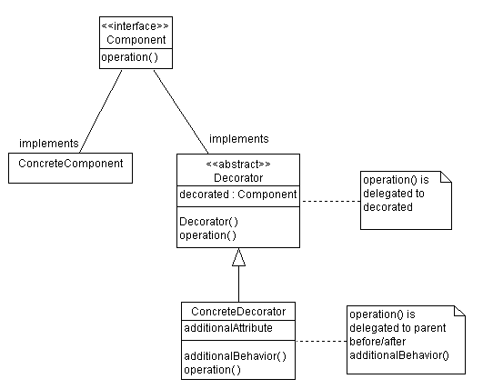

# Decorator（装饰者）模式
装饰者模式适用于给一个对象添加额外功能的情况，传统的类在进行功能添加时主要靠以下手段进行：
- 直接修改对象添加相应的功能
- 派生子类进行拓展

这样做的缺点显而易见，直接修改对象会造成该类随着时间推移愈发臃肿；子类派生的话如果增加的功能很多的时候会有一条非常长的继承线。

装饰器的做法是采用一个功能一个类的方式去往实例类中动态添加功能（使用功能类去包装需要此功能的对象），这样做既不会直接修改类中属性和方法，也不会有长的继承线。客户端可以根据实际需要，去加载它会使用到的功能。优点总结如下：
- 类的层次不会混乱
- 增加或减少功能不需要改变类中的数据结构
- 解耦，让核心职责和功能分开

## 完全组件（可适当删减）
- Component (被装饰对象基类)：定义对象的接口。
- ConcreteComponent（具体被装饰类）：继承自Component，对象类。
- Decorator（修饰者基类）：维护指向Component的引用，定义与其一样的接口。
- ConcreteDecorator（具体装饰者）：具体的装饰对象，给内部持有的具体被装饰对象增加具体的职责；

适当删减的意思是可以根据实际需求，删除修饰者基类，这是在系统不是很大的情况下适用。类结构图如下。



这里有一个简单[样例](https://www.cnblogs.com/panhouye/p/6120232.html),通过火锅对装饰者模式进行讲解。其中菜品属于装饰者，锅底属于被装饰者。
### 被装饰者基类
```
public interface GuoDi {
     public float cost();//锅底当然要有价钱啦
     public String name();//名字也得有哦
}
```
### 被装饰者实例类
```
public class YuanYang implements GuoDi {
    @Override
    public float cost() {
        return 48.0f;
    }
    @Override
    public String name() {
        return "鸳鸯锅底";
    }
}
public class DaLongYan implements GuoDi{
    @Override
    public float cost() {
        return 59.0f;
    }
    @Override
    public String name() {
        return "大龙燚火锅原味锅底";
    }
}
```
### 装饰者基类
```
public abstract class PeiCai implements GuoDi {
    private GuoDi guodi;
    public FoodDecorator(GuoDi guodi) {
        super();
        this.guodi = guodi;
    }
    @Override
    public float cost() {
        return guodi.cost();
    }
    @Override
    public String name() {
        return guodi.name();
    }
}
```

### 装饰者实例类
```
public class MaLaNiuRou extends PeiCai {
    public MaLaNiuRou(GuoDi guodi) {
        super(guodi);
    }
    @Override
    public float cost() {
        return super.cost()+46f;
    }
    @Override
    public String name() {
        return super.name()+"+麻辣牛肉";
    }
}
public class MaoDu extends PeiCai {

    public MaoDu(GuoDi guodi) {
        super(guodi);
    }
    @Override
    public float cost() {
        return super.cost()+30f;
    }
    @Override
    public String name() {
        return super.name()+"+大刀毛肚";
    }
}
```

### 调用方法
```
public class Test {
    public static void main(String[] args) {
        GuoDi  guodi = new DaLongYan ();//点个大龙燚火锅原味锅底
        MaLaNiuRou y = new MaLaNiuRou(guodi);//来个麻辣牛肉
        MaoDu  x = new MaoDu(y);//在麻辣牛肉的基础上再来个大刀毛肚
        System.out.println("一共点了"+x.name()+",共消费"+s.cost());
    }
}
```

这样做便把新菜品加入进去了。思考：使用传统方法会是怎样的情况，并且结合上面总结的优缺点。
