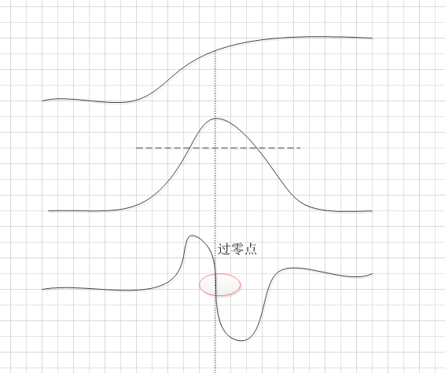

# 
 边缘检测 

## 边缘的定义
最常用的定义是理想阶梯型边缘(ideal step edge)

在一维的示例中，边缘就是在某个位置发生的灰阶变化，当灰阶变化越大时，边缘检测也越容易。但是
伴随着两个难点。

### １. 数码化
图像的采样不可能使得整个边缘刚好落在像素边界上，事实上灰阶的变化可能遍及一块区域的多个像素，在
一维的示例中就是“斜坡”，在数码化后的图像中，这个斜坡实际上呈现的是阶梯锯齿状。

### 2. 噪声问题
光强度、相机质量、移动、温度、大气效应、粉层等因素会增加图片上的噪声，因此在图片中表示相同灰阶
的像素在现实中是不同的。噪声是一种随机效应，因此只能通过统计的方法特征化。噪声对图像造成的结果是
使得有些像素的灰阶产生随机的变化，因此理想中的平滑线条在图像中是不可能存在的。**通常的做法是通过
噪声对图像造成的效果进行特征化，而噪声的特征可以通过特定平均值(mean)和标准偏差(standard
  deviation)的概率分布表示**。

在图像分析中，我们一般考虑两种类型的噪声：
- 信号无关的噪声(signal-independent noise)：随机的灰阶值，与图像数据无关，例如图像通过电信号进行传输时就会产生这种噪声。通常假设噪声服从均值为0的正态分布。
- 信号相关的噪声(signal-independent noise)：图像中的每一点的噪声值的大小为这一点的灰阶值的函数。一些照片中的颗粒就是这种噪声的例子。

图像的边缘是由灰阶（或者彩色）等高线定义的。穿过等高线的时候，灰阶值会迅速变化；沿着等高线走，会截止的变化会更加轻柔，有可能是随机变化。因此：边缘具有一个可以测量的方向。

边缘像素和噪声像素都具有的特点是：相比周围的像素有明显的灰阶变化。而边缘像素互相连接，构成了等高线，因此可以通过者一个特性将边缘像素和噪声像素区分。

基本上有三种常见的算子可以用于定位边缘：
- 导数算子：这种算子被设计会标识发生巨大强度变化的地方。
- 类似于模板匹配的方案，其中边缘由一个很小的图像进行建模，这个图像表现出了完美边缘的抽象属性。
- 一些算子使用了边缘的数学模型。其中最好的也使用了噪声模型，并且努力把噪声因素也考虑进去。

#### 导数算子
边缘是由灰阶值的变化定义的，因此对这种变化敏感的算子就可以用做边缘检测器。导数算子就可以。（未深入研究）

#### 基于模板的边缘检测
将一个小的离散的模板作为边缘的模型，常用的有Sobel边缘检测器，它具有如下的卷积掩模(convolution mask)作为模板：
$$
\begin{matrix}
-1 & -2 & -1\\
 0&   0&   0\\
 1&  2&    1
\end{matrix} = S_{y} \,\,\,\,\,\,\,\,
\begin{matrix}
-1 & -0 & 1\\
 -2&   0&   2\\
 -1&  0&    1
\end{matrix} = S_{x}
$$

计算了所有像素之后，得到的强度必须经过阈值处理，所有的像素都会对模板有一定的相应，但是只有非常大的相应才能评判未边缘。

另外一个例子是Kirsch算子，它有8个方向的矩阵，该算法会对每一个像素位置进行8次运算，算子在一个像素的相应为这8个掩模相应中的最大值。值为
$\pi/4*i$ ，其中$i$为具有最大相应的掩模编号。

#### 边缘模型：Marr-Hildreth边缘检测器
通过David Marr的研究，可以将一个边缘检测算法描述为：
- 1. 通过一个二维高斯函数对图像I进行卷积运算。（进行这一步的原因是自然场景一般不会出现衍射图案和其他波状效果，因此必须进行局部平均值计算，而符合生物视觉需求的最优平滑滤波器为高斯滤波）
- 2. 计算卷积图像的拉普拉斯算子，称为L。
- 3. 寻找边缘像素---在L中存在零交叉的像素。

##### 术语解释
过零点：数学性质，如果图像剧烈变化，进行一阶微分则会形成一个局部的极值，二阶微分则会形成一个过零点，并且在零点两边产生一个波峰和波谷。如图

过零点的确认：以p点为中心的3x3矩阵，p点过零点意味着至少有两个相对的领域的像素不同，有四种要检测的情况：左右、上下、和两个对角.如果g(x,y)的值与一个阈值比较（一种通用的方法），那么不仅要求相对领域的符号不同，数值差的绝对值要超过这个阈值，这时p称为一个过零点像素。

二阶函数关心的是图像灰度的突变，而不是强调灰度缓慢变化的区域， 所以对边缘的检测能力更强。

拉普拉斯算子：是n维欧几里得空间中的一个二阶微分算子，定义为梯度的散度，二维中公式如下：
$$
\triangle f = \frac{\partial^{2}f}{\partial x^{2}} + \frac{\partial^{2}f}{\partial y^{2}}
$$

图像差分：把图像像素点减去其相邻像素点，这样做可以削弱图像相似部分，进而突出图像的变化部分，这也于我们的边缘检测任务相契合。

#### Canny Edge 边缘检测器
Canny定义了一组边缘检测器应该达到的目标，并且描述了一个能够达到这些目标的最优化方法。
- **错误率**:边缘检测器应该只对边缘有相应，而且应该找到所有的边缘像素，不应该错过任何的边缘像素。
- **局部性(Localization)**:边缘检测器找到的边缘像素距离实际边缘的距离应该越小越好。
- **相应**:如果在一处只存在一个边缘像素，那么边缘检测器不应该识别出多个边缘像素。

Canny假定阶梯型边缘会受到高斯白噪声的影响。边缘检测器被假定为一个卷积过滤器$f$，$f$应该平滑噪声并定位边缘。
