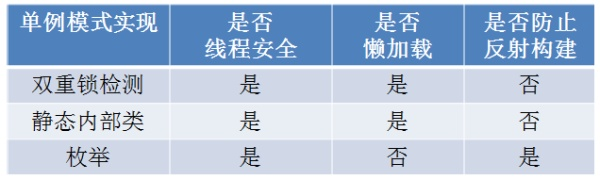

## <center>单例模式</center>
单例模式的几种实现方法

1. 懒汉单例模式

在第一次使用的时候才加载
```
public class Singleton{
  private static Singleton s;
  private Singleton(){}
  public static synchronized Singleton getInstance(){
    if(s == null){
      return new Singleton();
    }
    return s;
  }
}
```

2. 饿汉单例模式
类加载的时候就分配内存
```
public class Singleton{
  private static Singleton s = new Singleton();
  private Singleton(){}
  public static Singleton getInstance(){
    return s;
  }
}
```

3. 静态内部类实现的登记者模式:
```
public class Singleton{
  private Singleton(){}
  private static getInstance(){
    return Holder.s;
  }
  private static class Holder(){
    private static final Singleton s = new Singleton();
  }
}
```

4. DCL
```
public class Singleton{
  private static volatile Singleton s = null;
  private Singleton(){}
  public Singleton getInstance(){
    if(s == null){
      synchronized(Singleton.class){
        if(s == null){
          s = new Singleton();
        }
      }
    }
    return s;
  }
}
```

5. 枚举
```
public enum Singleton{
  s;
}
```

<div align=center>

</div>


[单例模式](https://zhuanlan.zhihu.com/p/33102022)
