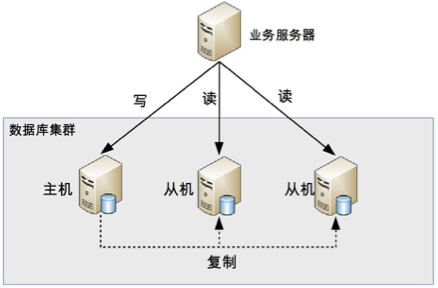

## 
 读写分离 

读写分离的实质是讲访问压力分散到集群中的多个节点，但是没有分散存储压力。
针对读多写少的业务比较好，集群的延迟可以通过缓存解决。

### 读写分离原理
基本原理是将数据库的读写操作分散到不同的节点上。如图

读写分离的基本实现是：
- 数据库服务器搭建主从集群，一主一从、一主多从都可以；
- 数据库主机负责读写操作，从机只负责读操作；
- 数据库主机通过复制将数据同步到从机，每台数据库服务器都存储了所有的业务数据；
- 业务服务器将写操作发送给主机，将读操作发送给数据库从机；

#### 注意
主从集群和主备集群存在差别，从机是需要做事情的，例如读操作就会让从机进行，而备机只需要同步数据，当主机发生意外时才会顶替。

读写分离的实现并不复杂，但是两个细节会引入设计复杂度：**主从复制延迟**和**分配机制**。

#### 复制延迟
以MySQL为例，主从复制的延迟可以是一秒，当数据量大时也可能是1分钟，所以这里会带来一个问题：如果业务服务器将数据写入到数据库主服务器后光速进行读取，并且在此时访问的恰好是从机，从机还没有把主机中的数据复制过来，读取不到最新的数据，业务便会出现问题，针对复制延迟的问题，常见的解决方法有：
- 1. 写操作之后的读操作指定发给数据库的主服务器：这种方法对业务的侵入和影响较大。
- 2. 从机读取失败之后再从主机读取一次：通常被叫做“二次读取”，正常处理没有问题，但是针对攻击可能会存在缺陷。
- 3. 关键业务的读取全部在主机进行，其余业务在从机进行：对于登陆+注册来说，属于关键业务，可以放入主机，对于浏览其他用户资料来说，属于非关键业务，可以放入从机。

#### 分配机制
将读写操作区分开来，访问不同的数据库，一般有两种方式：程序代码封装和中间件封装。

##### 程序代码封装
其旨在代码中抽象一个数据访问层，实现读写操作分离和数据库服务器连接的管理。基本架构如图：

其具有以下几个特点：
- 实现简单，可以根据实际需求做更多定制化的功能。
- 每种编程语言都需要自己实现一遍，如果各个子系统存在多种编程语言的话则存在重复开发的工作量。
- 故障情况下，如果主从发生切换，则需要修改配置后重启。

目前开源的实现方案中，淘宝的 TDDL（Taobao Distributed Data Layer，外号: 头都大了）是比较有名的。它是一个通用数据访问层，所有功能封装在 jar 包中提供给业务代码调用。其基本原理是一个基于集中式配置的 jdbc datasource 实现，具有主备、读写分离、动态数据库配置等功能，基本架构是：

##### 中间件封装
中间件封装指的是独立一套系统出来，实现读写操作分离和数据库服务器连接的管理。中间件对业务服务器提供 SQL 兼容的协议，业务服务器无须自己进行读写分离。对于业务服务器来说，访问中间件和访问数据库没有区别，事实上在业务服务器看来，中间件就是一个数据库服务器。其基本架构是：

特点：

- 能够支持多种编程语言，因为数据库中间件对业务服务器提供的是标准 SQL 接口。
- 数据库中间件要支持完整的 SQL 语法和数据库服务器的协议（例如，MySQL 客户端和服务器的连接协议），实现比较复杂，细节特别多，很容易出现 bug，需要较长的时间才能稳定。
- 数据库中间件自己不执行真正的读写操作，但所有的数据库操作请求都要经过中间件，中间件的性能要求也很高。
- 数据库主从切换对业务服务器无感知，数据库中间件可以探测数据库服务器的主从状态。例如，向某个测试表写入一条数据，成功的就是主机，失败的就是从机。

MySQL官方有MySQL Router中间件，其主要的功能有：读写分离，故障自动切换，负载均衡、连接池等。

