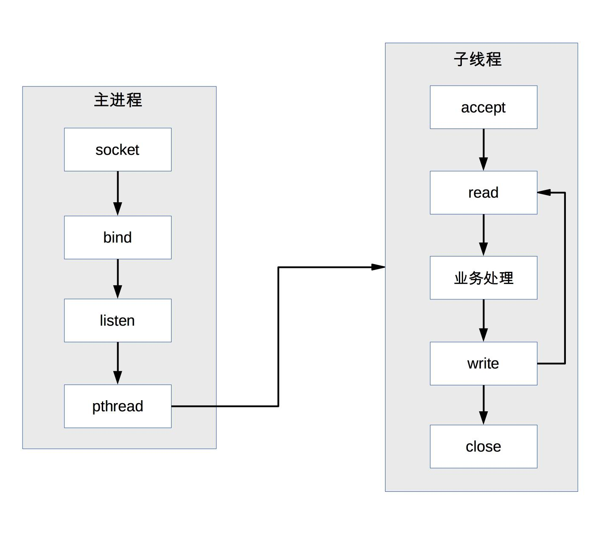

##
 单服务器高性能 

尽量通过提升单个服务器的性能，使得整体系统性能提升。

### PPC模式 （Process Peer Connection）

每一个请求对应一个进程，但是随着连接的增加，出现了主要的几个弊端：
- fork 代价高：站在操作系统的角度，创建一个进程的代价是很高的，需要分配很多内核资源，需要将内存映像从父进程复制到子进程。即使现在的操作系统在复制内存映像时用到了 Copy on Write（写时复制）技术，总体来说创建进程的代价还是很大的。
- 父子进程通信复杂：父进程“fork”子进程时，文件描述符可以通过内存映像复制从父进程传到子进程，但“fork”完成后，父子进程通信就比较麻烦了，需要采用 IPC（Interprocess Communication）之类的进程通信方案。例如，子进程需要在 close 之前告诉父进程自己处理了多少个请求以支撑父进程进行全局的统计，那么子进程和父进程必须采用 IPC 方案来传递信息。
- 支持的并发连接数量有限：如果每个连接存活时间比较长，而且新的连接又源源不断的进来，则进程数量会越来越多，操作系统进程调度和切换的频率也越来越高，系统的压力也会越来越大。因此，一般情况下，PPC 方案能处理的并发连接数量最大也就几百。

### Prefork
提前fork可以解决每次请求到了之后重新fork的局面，如图

但是这样还是没能解决父子进程通信的问题，因此应用不多。

### TPC（Thread Per Connection）

TPC 是 Thread Per Connection 的缩写，其含义是指每次有新的连接就新建一个线程去专门处理这个连接的请求。与进程相比，线程更轻量级，创建线程的消耗比进程要少得多；同时多线程是共享进程内存空间的，线程通信相比进程通信更简单。因此，TPC 实际上是解决或者弱化了 PPC fork 代价高的问题和父子进程通信复杂的问题。

虽然这样解决了fork代价高和进程间通信复杂的问题，但是也引入了新的问题：
- 创建线程虽然比创建进程代价低，但并不是没有代价，高并发时（例如每秒上万连接）还是有性能问题。
- 无须进程间通信，但是线程间的互斥和共享又引入了复杂度，可能一不小心就导致了死锁问题。
- 多线程会出现互相影响的情况，某个线程出现异常时，可能导致整个进程退出（例如内存越界）。

### prethread

Apache 服务器的 MPM worker 模式本质上就是一种 prethread 方案，但稍微做了改进。Apache 服务器会首先创建多个进程，每个进程里面再创建多个线程，这样做主要是为了考虑稳定性，即：即使某个子进程里面的某个线程异常导致整个子进程退出，还会有其他子进程继续提供服务，不会导致整个服务器全部挂掉。
