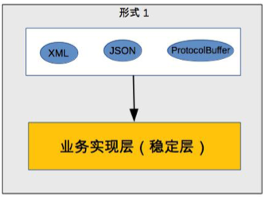
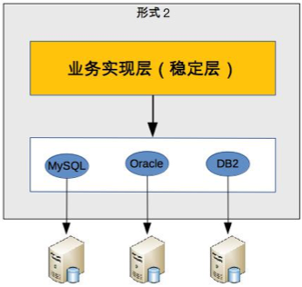

# 
软件架构学习

## 可扩展性
针对新的需求，无需改动或者仅仅需要少量修改就可以支持。架构师的目的就是预测未来可能的所有变化，并且把其考虑的系统架构中去。即是**正确预测变化，完美封装变化**。

针对业务，虽然有变化部分，但是有些功能是不会改变的，所以我们可以将其拆分为变化层和稳定层

例如，需要XML、JSON、ProtocolBuffer三种介入方式，则这便是变化层，但是具体的业务实现层就是稳定层。

当是涉及到具体的存储方式的时候，就变成了了

### 复杂性问题的引入

- **系统需要拆分成变化层和稳定层**:当问题不明确时，不同的人会有不同的看法。
- **需要涉及变化层和稳定层之间的接口**：针对变化层的接口，可以采用抽象层和实现层进行区分。

### 在实际工作场景中的解决方案：
- **使用分布式服务构建可复用的业务平台**:利用分布式服务框架(如Dubbo)可以将业务逻辑实现和可复用组件服务分离开，通过接口降低子系统或模块间的耦合性。新增功能时，可以通过调用可复用的组件实现自身的业务逻辑，而对现有系统没有任何影响。可复用组件升级变更的时候，可以提供多版本服务对应用实现透明升级，对现有应用不会造成影响。
- **分布式消息队列**:基于生产者-消费者编程模式，利用分布式消息队列(如RabbitMQ)将用户请求、业务请求作为消息发布者将事件构造成消息发布到消息队列，消息的订阅者作为消费者从消息队列中获取消息进行处理。通过这种方式将消息生产和消息处理分离开来，可以透明地增加新的消息生产者任务或者新的消息消费者任务。
